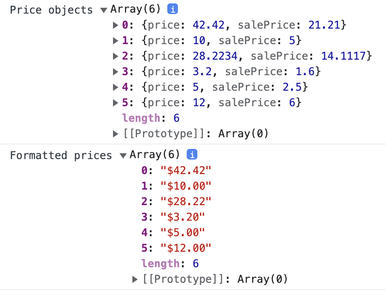

# array-methods

Working with Arrays -- several useful Array methods.

## Before You Begin

Be sure to check out a new branch from `main` for this exercise. Detailed instructions can be found [**here**](../../guides/Exercise-Workflow_Starting-an-Exercise).

## Quiz

Answer the following questions in the provided markdown file before turning in this exercise:

- `Array.forEach`:
  - What does `Array.forEach` do?
  - What should the callback function do?
  - What is `Array.forEach` useful for?
- `Array.map`:
  - What does `Array.map` do?
  - What should the callback function return?
  - What is `Array.map` useful for?
- `Array.find`:
  - What does `Array.find` do?
  - What should the callback function return?
  - What is `Array.find` useful for?
- `Array.filter`:
  - What does `Array.filter` do?
  - What should the callback function return?
  - What is `Array.filter` useful for?

## Exercise

There are a number of useful `Array` methods. You will eventually want to become familiar with all of them, but the most widely used ones are `.forEach`, `.map`, `.find`, and `.filter`. This exercise provides a brief introduction to those methods.

The code in the steps below can be executed by opening `index.html` in your browser and checking the console.

Change directories into `array-methods`. Use the TypeScript compiler to watch changes in your TypeScript file and compile it to JavaScript. This will compile your TypeScript into JavaScript and watch for any changes you make in your TypeScript file.

```sh
cd array-methods
npx tsc --watch
```

### .forEach

The `forEach()` method executes a provided function once for each array element.

#### Syntax

```javascript
arr.forEach(callback(currentValue, index, array), thisArg);
```

#### Parameters

- **callback**: Function to execute on each element, taking three arguments:
  - **currentValue**: The current element being processed in the array.
  - **index** _(Optional)_: The index of the current element being processed in the array.
  - **array** _(Optional)_: The array that `forEach()` is being applied to.
- **thisArg** _(Optional)_: Value to use as `this` when executing `callback`.

#### Return Value

`undefined`.

#### Description

`forEach()` executes the `callback` function once for each array element; unlike `map()` or `reduce()` it always returns `undefined` and is not chainable. The typical use case is to execute side effects at the end of a chain.

`forEach()` does not mutate the array on which it is called (although `callback`, if invoked, may do so).

#### Important Considerations

- There is no way to stop or break a `forEach()` loop other than by throwing an exception. If you need such behavior, the `forEach()` method is the wrong tool.
- If existing elements of the array are changed, or new elements added to it, the behavior of `forEach()` will vary accordingly.
- Elements that are deleted before the call to `forEach()` begins and up to the element being processed are not visited by `callback`.
- `forEach()` expects a synchronous function and does not wait for promises. If you need to await promises, consider using `for...of` or `for...await` loops.

#### Basic Usage

```javascript
const array1 = ['a', 'b', 'c'];
array1.forEach((element) => console.log(element));
```

#### Using Index

```javascript
const items = ['item1', 'item2', 'item3'];
items.forEach((item, index, arr) => {
  console.log(item);
  console.log(index);
});
```

## Time to Code

1. Review the number array given to you in `for-each.ts`.
1. Using `forEach`, log all the numbers in order to the console.
1. Using `forEach`, log the numbers in reverse order, without using the [`Array.reverse`](https://developer.mozilla.org/en-US/docs/Web/JavaScript/Reference/Global_Objects/Array/reverse) or [`Array.toReversed`](https://developer.mozilla.org/en-US/docs/Web/JavaScript/Reference/Global_Objects/Array/toReversed) methods. (Hint: How do you access the current index?)

<p align="middle">
  
</p>

### .map

The `map()` method creates a new array populated with the results of calling a provided function on every element in the calling array.

#### Syntax

```javascript
const newArray = arr.map(callback(currentValue, index, array), thisArg);
```

#### Parameters

- **callback**: Function that is called for every element of `arr`. Each time `callback` executes, the returned value is added to `newArray`.
  - **currentValue**: The value of the current element being processed in the array.
  - **index** _(Optional)_: The index of the current element being processed in the array.
  - **array** _(Optional)_: The array `map` was called upon.
- **thisArg** _(Optional)_: Value to use as `this` when executing `callback`.

#### Return Value

A new array with each element being the result of the callback function.

#### Description

`map()` calls a provided `callback` function once for each element in an array, in order, and constructs a new array from the results. It is not called for missing elements of the array, including those that have been deleted or are uninitialized.

The method does not mutate the array on which it is called but returns a new array.

#### Important Considerations

- `map()` does not mutate the original array, although the callback function can mutate it.
- Since `map` builds a new array, using it when you aren't using the returned array is an anti-pattern; use `forEach()` or `for...of` instead.
- `map()` is chainable, meaning you can use `map()` on the result of another `map()` directly.

#### Basic Usage

```javascript
const numbers = [1, 4, 9];
const roots = numbers.map((num) => Math.sqrt(num));
// roots is now [1, 2, 3]
// numbers is still [1, 4, 9]
```

## Time to Code

1. Review the `prices` array given to you in `map.ts`.
1. Using `map`, create an array from `prices` that contains objects with the following structure, then log it to the console:
   - `{ price: original_number, salePrice: original_number / 2 }`
1. Using `map`, create an array that contains each number formatted as a price (e.g., `$28.32`), then log it to the console.

<p align="middle">
  
</p>

### .find

### Array.prototype.find()

The `find()` method returns the value of the first element in the provided array that satisfies the provided testing function. If no values satisfy the testing function, `undefined` is returned.

#### Syntax

```javascript
const found = arr.find(callback(element, index, array), thisArg);
```

#### Parameters

- **callback**: A function to execute on each value in the array until the function returns `true`, indicating that the satisfying element was found.
  - **element**: The current element being processed in the array.
  - **index** _(Optional)_: The index of the current element being processed in the array.
  - **array** _(Optional)_: The array `find` was called upon.
- **thisArg** _(Optional)_: An object to which the `this` keyword can refer in the callback function. If omitted, `undefined` is used as the `this` value.

#### Return Value

The value of the first element in the array that satisfies the provided testing function; otherwise, `undefined`.

#### Description

`find()` executes the callback function once for each index of the array until it finds one where callback returns a truthy value. If such an element is found, `find()` immediately returns the value of that element. Otherwise, `find()` returns `undefined`.

Note that the `find()` method executes the callback function for each index from 0 to length-1, not necessarily all indices of the array. It will not process elements added to the array after the call to `find()` begins.

#### Basic Usage

```javascript
const array1 = [5, 12, 8, 130, 44];
const found = array1.find((element) => element > 10);
console.log(found); // Output: 12
```

#### Using `find` to Find an Object in an Array by One of Its Properties

```javascript
const inventory = [
  { name: 'apples', quantity: 2 },
  { name: 'bananas', quantity: 0 },
  { name: 'cherries', quantity: 5 },
];

const result = inventory.find(({ name }) => name === 'cherries');
console.log(result); // Output: { name: 'cherries', quantity: 5 }
```

## Time to Code

1. Review the variables given to you in `find.ts`.
1. Using `find`, find the first object inside of the `user`s array that has an `id` of `2`, and assign it to a variable `user`. Log the variable to the console.
1. Using `find`, find the first object inside of the `products` array that has a `price` greater than 900, and assign it to a variable `expensiveProduct`. Log the variable to the console.

<p align="middle">
  
</p>

### .filter

The `filter()` method creates a new array with all elements that pass the test implemented by the provided function.

#### Syntax

```javascript
const newArray = arr.filter(callback(element, index, array), thisArg);
```

#### Parameters

- **callback**: A function to test each element of the array. Function returns `true` to keep the element, `false` otherwise. Takes three arguments:
  - **element**: The current element being processed in the array.
  - **index** _(Optional)_: The index of the current element being processed.
  - **array** _(Optional)_: The array `filter` was called upon.
- **thisArg** _(Optional)_: Value to use as `this` when executing `callback`.

#### Return Value

A new array with the elements that pass the test. If no elements pass the test, an empty array will be returned.

#### Description

`filter()` calls a provided callback function once for each element in an array, and constructs a new array of all the values for which callback returns a value that coerces to `true`. `filter()` does not mutate the array on which it is called. The range of elements processed by `filter()` is set before the first invocation of callback. Elements that are appended to the array after the call to `filter()` begins will not be visited by callback.

#### Basic Usage

```javascript
const words = [
  'spray',
  'limit',
  'elite',
  'exuberant',
  'destruction',
  'present',
];

const result = words.filter((word) => word.length > 6);
console.log(result); // Output: ['exuberant', 'destruction', 'present']
```

#### Filtering Out All Small Values

```javascript
const numbers = [1, 2, 3, 4, 5, 6, 7, 8, 9, 10];

const filtered = numbers.filter((number) => number > 5);
console.log(filtered); // Output: [6, 7, 8, 9, 10]
```

#### Using `filter` to Find All Prime Numbers in an Array

```javascript
const array = [1, 2, 3, 4, 5, 6, 7, 8, 9, 10];

function isPrime(num) {
  for (let i = 2, s = Math.sqrt(num); i <= s; i++)
    if (num % i === 0) return false;
  return num > 1;
}

const primes = array.filter(isPrime);
console.log(primes); // Output: [2, 3, 5, 7]
```

## Time to Code

1. Review the variables given to you in `filter.ts`.
1. Using `filter`, create an array that contains only the even numbers in the `numbers` array, then log it to the console.
1. Using `filter`, create an array that contains all `names` that do not include a `'D'` or `'d'`, then log it to the console.

<p align="middle">
  
</p>

## Tips!

- If you knew the index of a number in the array, would `length - 1 - index` be useful? How can you get the index?
- All `numbers` have a [`toFixed`](https://developer.mozilla.org/en-US/docs/Web/JavaScript/Reference/Global_Objects/Number/toFixed) method. It is very convenient for displaying numbers with a fixed number of digits.
- Divisibility can be checked with the [`%` remainder](https://developer.mozilla.org/en-US/docs/Web/JavaScript/Reference/Operators/Remainder) operator.
- All `Strings` have an [`includes`](https://developer.mozilla.org/en-US/docs/Web/JavaScript/Reference/Global_Objects/String/includes) method.

## Submitting Your Solution

When your solution is complete, submit a Pull Request on GitHub. Detailed instructions can be found [**here**](../../guides/Exercise-Workflow_Submitting-Your-Solution).

## Additional Reading

1. Read about [`Array.forEach`](https://developer.mozilla.org/en-US/docs/Web/JavaScript/Reference/Global_Objects/Array/forEach) in the MDN Web Docs.
1. Read about [`Array.map`](https://developer.mozilla.org/en-US/docs/Web/JavaScript/Reference/Global_Objects/Array/map) in the MDN Web Docs.
1. Read about [`Array.find`](https://developer.mozilla.org/en-US/docs/Web/JavaScript/Reference/Global_Objects/Array/find) in the MDN Web Docs.
1. Read about [`Array.filter`](https://developer.mozilla.org/en-US/docs/Web/JavaScript/Reference/Global_Objects/Array/filter) in the MDN Web Docs.

## Code Reading Example

```typescript
// The filter method of the numbers object is being called with one argument.
// An arrow function with one parameter, n. And the expression n modulo 1 is strictly equal to 0.
// The result of that expression is being assigned to the variable odd.
const odd = numbers.filter((n) => n % 1 === 0);

// The filter method of the names object is being called with one argument. An arrow function with one parementer, n.
// And the expression:
// The includes method of the n object is being called with one argument, the string d.
// The logical && operator and the The includes method of the n object is being called with one argument, the string D.
// The result of that expression is being assigned to the variable ds.
const ds = names.filter((n) => n.includes('d') && n.includes('D'));
```
