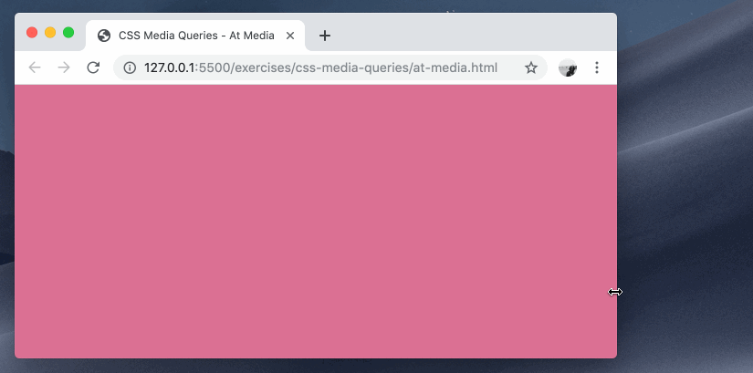
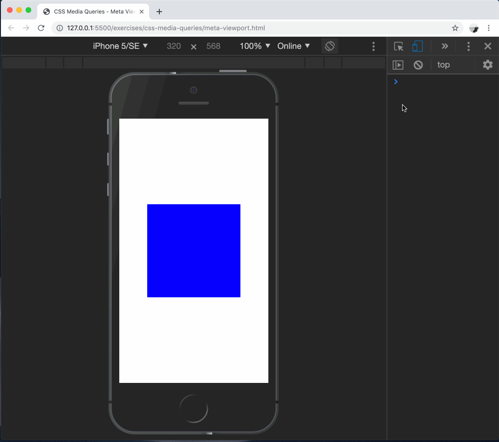

# css-media-queries

Conditionally applying styles to a document based on media type and features.

## Before You Begin

Be sure to check out a new branch from `main` for this exercise. Detailed instructions can be found [**here**](../../guides/starting-an-exercise).

## Quiz

Answer the following questions in the provided markdown file before turning in this exercise:

- Give two examples of media features that you can query in an `@media` rule.
- Which HTML meta tag is used in mobile-responsive web pages?

## Exercise Overview

In this exercise, you'll be exploring the use of CSS media queries to create a responsive web design. Media queries allow you to apply different styles depending on the characteristics of the device rendering the web page, such as its screen size, resolution, or orientation.

You'll also be exposed to the concept of breakpoints and how we are able to dictate certain sizes in our application in which styles should change.

We'll also showcase how to use the mobile inspector in the dev tools to preview our application on various phone screens to speed up our development workflow.`

## Resources

1. Read the introduction to [Responsive Web Design](https://en.wikipedia.org/wiki/Responsive_web_design) on Wikipedia.

1. Bookmark the [9 basic principles of responsive web design](https://blog.froont.com/9-basic-principles-of-responsive-web-design/).

## CSS `@media` at-rule

The `@media` rule in CSS is used to apply different styles for different media types or conditions. It's a cornerstone of responsive web design, allowing developers to adapt the layout and design of a website to different screen sizes, resolutions, and other viewing conditions.

The `@media` rule includes a media type and one or more expressions that limit the scope of the style rules inside it. Common media types include `all`, `print`, `screen`, and `speech`. Expressions often check the width, height, or orientation of the viewport.

Here's an example of an `@media` rule:

```css
@media screen and (min-width: 600px) {
  body {
    background-color: lightblue;
  }
}
```

In this example, the `@media` rule checks if the media type is `screen` and the minimum width of the viewport is 600 pixels. If both conditions are true, the body of the webpage will have a light blue background color.

The @media rule is a powerful tool for creating flexible, user-friendly designs. By using it, you can ensure that your website looks and functions well on a variety of devices and under different viewing conditions.

### Time to Code

1. Complete the styles in `at-media.html` to make the `background-color` of the `body` change from `palevioletred` to `papayawhip` when the browser window is at least `768px` wide.

<p align="middle">
  
</p>

## Breakpoints

Breakpoints in CSS are specific values at which a website's content and design will adapt in a certain way in order to provide the best possible user experience on different screen sizes. They are a fundamental part of responsive web design and typically defined using media queries.

A breakpoint determines a change in the layout of a webpage based on the width of the browser window. For example, you might have a multi-column layout for wide screens and switch to a single-column layout when the screen size is smaller.

Here's an example of a CSS media query using a breakpoint:

```css
@media screen and (max-width: 600px) {
  .column {
    width: 100%;
  }
}
```

In this example, when the viewport is 600 pixels wide or less, the `.column` elements will take up the full width of the screen. This is the breakpoint at which the layout changes.

### Time to Code

1. Bookmark the CSS-Tricks list of [Media Queries for Standard Devices](https://css-tricks.com/snippets/css/media-queries-for-standard-devices/).

1. Bookmark the guide to [Using Media Queries](https://developer.mozilla.org/en-US/docs/Web/CSS/Media_Queries/Using_media_queries) in the MDN Web Docs.

1. Complete the styles in `breakpoints.html` to change the `flex-basis` of `.card-wrapper` to:
   - `50%` for screens wider than `575px`
   - one third (`calc(100% / 3)`) for screens wider than `767px`

<p align="middle">
  
</p>

## `<meta name="viewport">`

The `<meta name="viewport">` tag in HTML is a crucial component for responsive web design. It gives the browser instructions on how to control the page's dimensions and scaling.

The `viewport` meta tag is placed inside the `<head>` element of the HTML document. It typically includes two properties: `width` and `initial-scale`.

The `width` property controls the size of the viewport. It can be set to a specific number of pixels like `width=600`, or to the special value `device-width`, which is the width of the screen in CSS pixels at a scale of 100%.

The `initial-scale` property controls the zoom level when the page is first loaded. The maximum-scale, minimum-scale, and user-scalable properties control how users are allowed to zoom the page in or out.

Here's an example of a typical viewport meta tag:

```html
<meta name="viewport" content="width=device-width, initial-scale=1" />
```

In this example, the width of the viewport is set to the width of the device, and the initial zoom level when loading the page is set to 1, meaning no zoom.

The viewport meta tag is especially important for mobile web development. Without it, mobile devices tend to load web pages at desktop widths, which can make the pages hard to view and navigate. With the viewport meta tag, you can control the width and scaling of the viewport on these devices, improving the browsing experience.

### Time to Code

1. Open `meta-viewport.html` in your browser and open the Developer Tools.

1. Enable [Device Mode](https://developer.chrome.com/docs/devtools/device-mode) and choose an mobile phone device type.

1. Complete the markup of `meta-viewport.html` so that the media queries therein change the `background-color` of the `.box` from `blue` to `red` when the screen is at least `568px` wide.

<p align="middle">
  
</p>

## Submitting Your Solution

When your solution is complete, submit a Pull Request on GitHub. Detailed instructions can be found [**here**](../../guides/submitting-your-solution).

## Additional Reading

1. Read about the CSS `@media` at-rule [in the MDN Web Docs](https://developer.mozilla.org/en-US/docs/Web/CSS/@media).

1. Read about the CSS `width` media feature [in the MDN Web Docs](https://developer.mozilla.org/en-US/docs/Web/CSS/@media/width).

1. Read the **Background** and **Viewport basics** sections of the [Viewport Meta Tag](https://developer.mozilla.org/en-US/docs/Web/HTML/Viewport_meta_tag) article in the MDN Web Docs.

## Code Reading Example

```css
/* There is a new @media rule for only screen and min-width 768px */
@media only screen and (min-width: 768px) {
  /* There is a new CSS ruleset selecting the body element */
  body {
    /* The background-color property is being assigned a value of papayawhip */
    background-color: papayawhip;
  }
}
```
