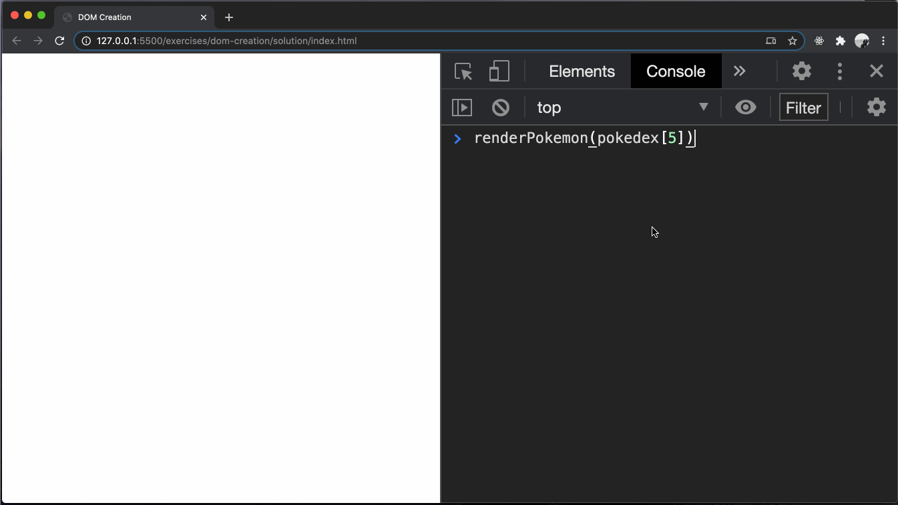

# dom-creation

Creating new DOM trees to insert into a web page.

## Before You Begin

Be sure to check out a new branch from `main` for this exercise. Detailed instructions can be found [**here**](../../guides/starting-an-exercise).

## Quiz

Answer the following questions in the provided markdown file before turning in this exercise:

- Does the `document.createElement()` method insert a new element into the page?
  No, because creating an element just creates the DOM object in JavaScript.
- How do you add an element as a child to another element?
  You would attach 'appendChild()' to the object referencing the target element.
- What do you pass as the arguments to the `element.setAttribute()` method?
  'element.setAttribute()' takes two arguments, the first being the attribute, the second being the value.
- What steps do you need to take in order to insert a new element into the page?
  1. Create element
  2. Set attributes and properties
  3. Append to parent
- What is the `textContent` property of an element object for?
  It is to add and retrieve the text value of an element
- Name two ways to set the `class` attribute of a DOM element.
  1. Use the 'createElement()' method adding '.class-name' to the argument.
  2. Use the 'setAttribute()' method, setting the first argument as 'class' and the second with the desired class name.
- What are two advantages of defining a function to do create something (like the work of creating a DOM tree)?
  It makes it become a readily repeatable action and makes the code less verbose.

## Exercise Overview

One of the most common things you will do as a Web Developer is DOM creation and that is because it allows a website to dynamically update based on the data available to it.

For this exercise, you are going to learn how to create a HTML rendering function that will take in an `object` of data and use the data in that object to create an HTML structure and return it.

You will also learn how to use a loop to loop through an array of data so that you can use your function to create multiple HTML collections and add them all to the DOM.

You will notice that the objects you will be using for this exercise are included as part of an array of many objects.

This is one of the most common styles of data you will be using for DOM creation as an array of objects allows you to have a standardized object design so that it is much easier to design a function that can turn the data from each object into a similar HTML structure and add those new elements to the page.

Check out the example output you should see at the end of this exercise:

<p align="middle">
  
</p>

Notice the following about the above:

- Each of the rendered Pokemon have the same HTML structure
- Each of the rendered Pokemon have:
  - An image
  - A title
  - A number
  - A description

## Problem Breakdown

Now its time to think like a programmer and break this problem down into completable steps

As an example of how to break a problem down into completable steps, let's breakdown the series of steps that need to be completed in order to get the example output:

1. Create a function that takes in one object of data and does the following:
   - Creates each element needed for the HTML structure
   - Uses the data from the data object parameter to populate the HTML elements with the correct data:
     - For example, text content, image source, etc
   - Returns the completed HTML structure
1. Query the DOM for the correct element to add the newly created HTML collection to and store it in a variable
1. Loop through the array of data and do the following for each iteration of the loop:
   - Call the HTML rendering function you created and pass the object at the current index of the array to that function and store the returned HTML collection in a variable
   - Append the HTML collection stored in the variable to the proper location on the DOM

Notice that there is now a clear set of steps that must be completed for the example functionality to work. Solving a problem is much easier when you know the steps to complete.

Make sure to continue to practice problem breakdowns!

## Creating DOM Elements

In web development, creating DOM elements dynamically using JavaScript is common practice. This approach allows developers to generate and manipulate elements on the fly, providing flexibility and interactivity to web applications. In large-scale applications, data objects or datasets will usually be provided from a database via an API. In order to successfully show this stored data on the web page, an existing element must be updated with this content, or a new element containing this element must be created.

In JavaScript, creating DOM elements involves the following steps:

1. **Create element**: A new DOM element must be created using a method such as `document.createElement`, specifying the element type.

1. **Set attributes and properties**: Optionally, set attributes (eg., `id`, `class`, `src`) and properties (e.g., `textContent`, `value`) of the newly created element to customize its appearance and behavior.

1. **Append to parent**: Append the newly created element to its parent node in the DOM using a method such as `appendChild()`.

Let's take a look at each one of these steps individually.

### Create Element

There are technically a few ways of creating DOM elements in JavaScript, although generally only one of these will be used.

1. `document.createElement()`: This method creates a new element with the specified tag name. This is the most used method when it comes to creating DOM elements.

   ```typescript
   const $button = document.createElement('button');
   ```

1. `innerHTML`: This property can be used to get or set the HTML content inside an element. This can be used to create new elements, however it should generally be avoided, because it makes you vulnerable to Cross-Site Scripting (XSS) attacks.

   ```typescript
   const $container = document.querySelector('#container');
   container.innerHTML = '<div>New Element</div>';
   ```

1. `outerHTML`: This property gets or sets the HTML content including the current element. You can use it to replace an existing element with new elements.

   ```typescript
   const $container = document.querySelector('#container');
   element.outerHTML = '<div>New div</div>';
   ```

While any of these methods technically are capable of creating DOM elements, the best option is generally going to be `document.createElement()`. It is the most efficient method, and also is the most safe, since you do not need to worry about sanitizing the HTML to avoid XSS attacks, which both `innerHTML` & `outerHTML` can cause.

Let's now take a look at how to give these elements attributes and content.

### Set Attributes and Properties

After a DOM element has been created, additional attributes can be set on the element to customize its appearance and behavior. While this can look wildly different depending on the exact content or attributes an element needs, here is an example of what this step looks like:

```typescript
// Create the DOM element
const $button = document.createElement('button');

// Now we will start assigning content and attributes
$button.setAttribute('id', 'submit-button');
$button.setAttribute('type', 'submit');
$button.className = 'submit-button bg-black';
$button.textContent = 'Submit';
```

Here is what this element would look like in HTML:

```html
<button id="submit-button" class="submit-button bg-black" type="submit">
  Submit
</button>
```

The exact attributes you create or properties you use can vary depending on which element you use. If we were to create an image for example, we would be assigning something to the `src` & `alt` attributes respectively.

Another thing of note here is the use of `setAttribute`. `setAttribute` is a very powerful method that can be used to assign a value to any attribute. It will take in 2 arguments, the first being a string of the attribute you are trying to create or update, like `class`, `id`, `type`, etc. The 2nd argument is the value that you would like to assign to that attribute.

### Appending to Parent

After a DOM element has been created and given attributes & content, it still needs to get added to the web page. Creating an element **does not** automatically add it to the page, it just creates the DOM object in JavaScript. In order to actually see this newly created item on the page, it must be appended to an element that currently already exists on the DOM.

There are quite a few different methods that can be used to accomplish this. Here are a few of them:

1. **`appendChild`**: This method appends a node as the last child of a node.

   ```typescript
   const $newElement = document.createElement('div');
   document.body.appendChild($newElement);
   ```

1. **`append`**: This method inserts a set of Node objects after the last child of the parent node.

   ```typescript
   const $newElement1 = document.querySelector('div');
   const $newElement2 = document.querySelector('h2');
   document.body.append($newElement1, $newElement2);
   ```

1. **`prepend`**: This method inserts a set of Node objects before the first child of the parent node.

   ```typescript
   const $newElement1 = document.querySelector('div');
   const $newElement2 = document.querySelector('h2');
   document.body.prepend($newElement1, $newElement2);
   ```

## Setup

1. Read the data model provided in `main.ts`.
1. Change directories into `dom-creation`. Use the TypeScript compiler to watch changes in your TypeScript file and compile it to JavaScript. This will compile your TypeScript into a JavaScript file and watch for any changes you make in your TypeScript file.

   ```sh
   cd dom-creation
   npx tsc --watch
   ```

## Exercise

1. In `main.ts`, define a function named `renderPokemon` with one parameter: `pokemon`.
   - `pokemon` should have a type of `Pokemon`
   - `renderPokemon` should have a return type of `HTMLDivElement`
1. In `renderPokemon`'s code block, write code that builds the following DOM tree. See the tips below.
   ```html
   <div class="column-third">
     <div class="pokemon-card">
       
       <div class="pokemon-card-text">
         <h2>Pikachu</h2>
         <h3>#025</h3>
         <p>
           Pikachu that can generate powerful electricity have cheek sacs that
           are extra soft and super stretchy.
         </p>
       </div>
     </div>
   </div>
   ```
   - Calling `renderPokemon` **should not add any elements to the page**.
   - The function should **only return the outer div** as that element will contain all of the other elements.
   - Test your function in the browser console at each step of the way by passing one of the objects from `pokedex` as an argument.
   - Start by simply creating the outer `"column-third"` div, setting its `class` and returning it.
   - Then, create the inner `"pokemon-card"` div and append it to the `"column-third"` div before the outer div is returned.
   - Compare your function's output to the example HTML above as you go.
   - Use the properties (`name`, `number`, `imageUrl`, `description`) of the `pokemon` parameter to set attributes and text for your elements where necessary.
   <p align="middle">
     
   </p>
1. Once your `renderPokemon` function is working properly, do the following at the bottom of `main.ts`:
   - Query the DOM for the `"row"` element.
   - Utilizing your variable for the `"row"` element, create a conditional statement that looks something like this.
     ```ts
     if (!$row) throw new Error('The $row query failed');
     ```
   - Loop through your `pokedex` array and for each object:
     - pass the object to `renderPokemon` and get its return value
     - append the DOM tree returned by `renderPokemon` to the `"row"` element

### Final Result

<p align="middle">
  
</p>

## Submitting Your Solution

When your solution is complete, submit a Pull Request on GitHub. Detailed instructions can be found [**here**](../../guides/submitting-your-solution).

## Additional Resources

1. Read about [creating DOM elements](https://javascript.info/modifying-document#creating-an-element)
1. Read about [`textContent`](https://developer.mozilla.org/en-US/docs/Web/API/Node/textContent) on MDN
1. Read about how to insert elements to the DOM using [`appendChild()`](https://developer.mozilla.org/en-US/docs/Web/API/Node/appendChild).

## Code Reading Example

```typescript
// The createElement method of the document object is being called with one argument, a string div
const $columnThird = document.createElement('div');

// The setAttribute method of the $columnThird object is being called with two arguments, both strings.
$columnThird.setAttribute('class', 'column-third');

// The appendChild method of the $row object is being called with one argument, $columnThird variable
$row.appendChild($columnThird);
```
