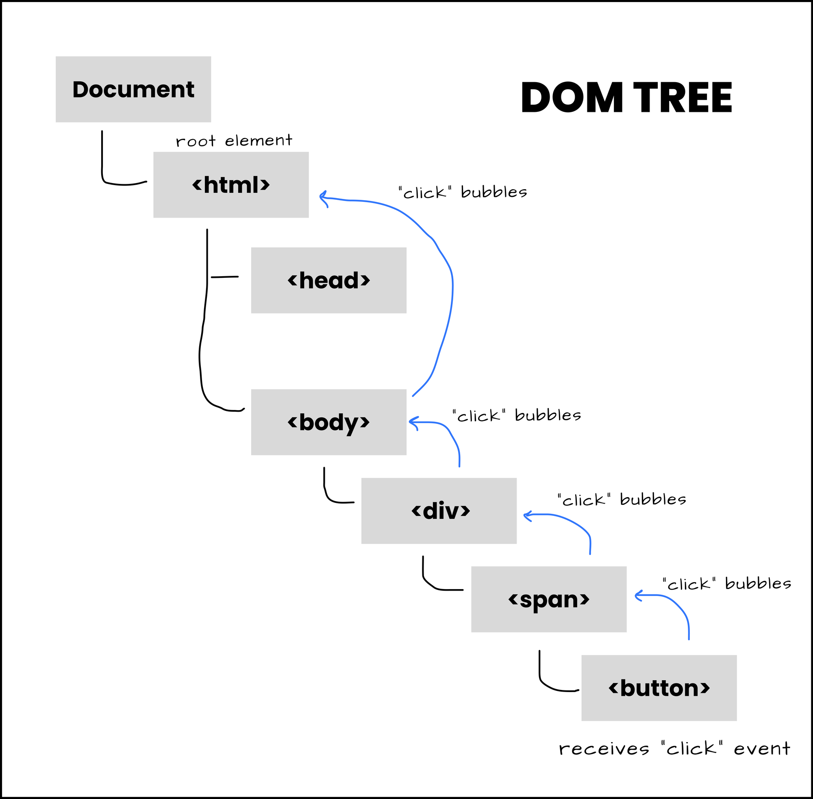
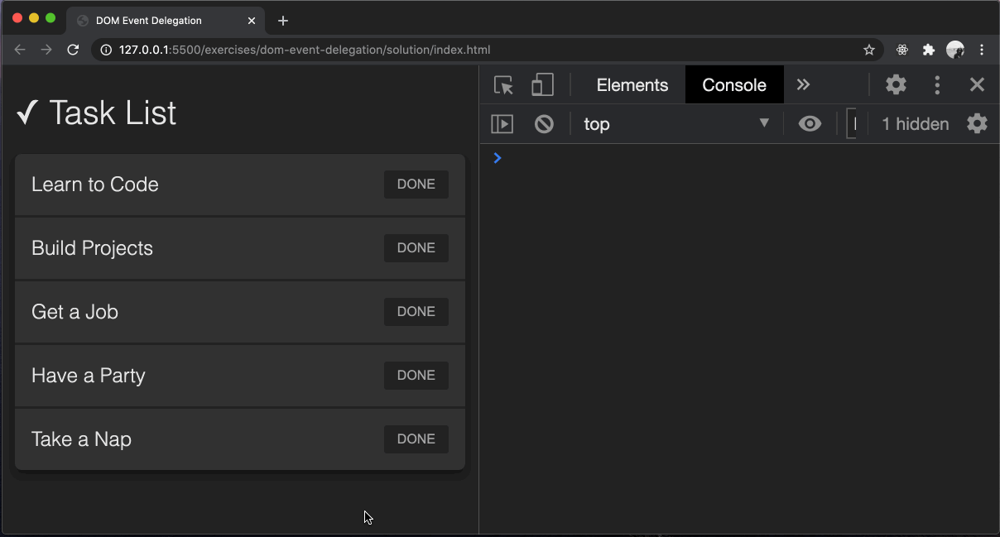

# dom-event-delegation

Leveraging event bubbling to respond to events on descendent elements.

## Before You Begin

Be sure to check out a new branch from `main` for this exercise. Detailed instructions can be found [**here**](../../guides/starting-an-exercise).

## Quiz

Answer the following questions in the provided markdown file before turning in this exercise:

- What is the `event.target`?
  It points to the element that triggers the event.
- Why is it possible to listen for events on one element that actually happen its descendent elements?

- What DOM element property tells you what type of element it is?
- What does the `element.closest()` method take as its argument and what does it return?
- How can you remove an element from the DOM?
- If you wanted to insert new clickable DOM elements into the page using JavaScript, how could you avoid adding an event listener to every new element individually?

## Exercise Overview

In this exercise, you will be learning how to take advantage of event delegation to capture events on multiple elements with only one event listener.

Rather than adding event listeners to every single element individually, we can utilize event delegation to limit the amount of event listeners we need. This is really important for a few reasons:

1.  **Efficiency**: Instead of attaching event listeners to every individual element, you can attach a single event listener to a parent element. This reduces the amount of code you need to write and can improve performance, especially when dealing with a large number of elements.

1.  **Dynamic Element Handling**: If new elements are added to the DOM that should trigger the same event, you don't need to add new event listeners for them. The event listener on the parent element will handle events from the new elements as well.

1.  **Memory Footprint**: Having fewer event listeners can reduce the memory footprint of your application, which can be particularly beneficial in large-scale applications.

1.  **Consistency**: If multiple elements should trigger the same event, event delegation ensures that the behavior is consistent across all of these elements.

As you can see, there are quite a few benefits of event delegation, which is why we will take advantage of it often as developers!

Now let's take a look at our example. Note the example functionality below:

<p align="middle">
  
</p>

Let's look at a breakdown of what is happening in the example above:

- When a user clicks anywhere on a task item, the following actions occur:
  - The `event.target` is logged to the console, showing which element was interacted with
  - The `event.target.tagName` is logged to the console, indicating the tag name of the element that was interacted with
- When the user clicks on the "Done" button, the task list item is removed from the page

**NOTE**: Notice how the task list item only disappears when the "Done" button is interacted with

## Problem Breakdown

Now its time to think like a programmer and break this problem down into completable steps

As an example of how to break a problem down into completable steps, let's breakdown the series of steps that need to be completed in order to get the example functionality:

1. The element that will be referenced and given an event listener must be selected from the DOM and stored in a variable.
1. Add an event listener to the variable stored in the previous step that will listen for all click events triggered by the user.
1. A callback function must be created to handle the `click` events
1. The callback function must perform the following actions:
   - Logs the `event.target`
   - Logs the `event.target.tagName`
   - Verifies that the element that was interacted with was a `BUTTON` and then perform the following actions:
     - Find the parent `li` element of the `BUTTON` element that was interacted with and store it to a variable
     - Logs the variable that stores a DOM reference to the current task list item
     - Removes the current task list item from the DOM utilizing the variable that stores a DOM reference to the current task list item

Notice that there is now a clear set of steps that must be completed for the example functionality to work. Solving a problem is much easier when you know the steps to complete.

Being able to break down bigger problems into smaller ones is something that should be practiced regularly, as it is a primary skill for any developer.

## Event Bubbling and Capturing

Event bubbling is a fundamental concept in JavaScript's event handling mechanism. When an event occurs on a particular DOM element, such as a click, it doesn't just affect that specific element-it ripples through its ancestors in the DOM hierarchy. This propagation from the innermost nested element to the outermost ancestor is known as event bubbling.

Imagine a scenario where you have nested HTML elements, like a `<div>` inside another `<div>`. If a click event occurs on the inner `<div>`, the browser doesn't stop there; it continues to notify the parent `<div>`, then its parent, and so on, until it reaches the root of the document.

```html
<div id="outter">
  <div id="inner">Click me!</div>
</div>

<script>
  const $outterDiv = document.querySelector('#outter');

  $outterDiv.addEventListener('click', () => {
    console.log('This runs even if you click on the inner div');
  });
</script>
```

In the snippet above, two `div` elements were created and added to the webpage. Inside the JavaScript, an event listener was only added to the outter div. Since almost all events in JavaScript have this "bubbling" process, parent elements can catch events that happen on it's children. So even though the event listener was added to the outter div, if you click on the inner div, the outter div event handler will still fire, because the event bubbled upward from the inner element to its parents.

Here is a visual example of how event propagation works:

<p align="middle">
  
</p>

When an event occurs on a webpage, it will start at the Document, and work it's way down towards the DOM tree until it finds the element that triggered the event. Once the element is found, the event will then bubble back upwards the DOM tree back until it reaches the Document.

Understanding event bubbling is crucial for managing event listeners efficiently, as it allows you to handle events at different levels of the DOM hierarchy without attaching multiple listeners to individual elements. By leveraging event bubbling, you can write cleaner and more maintainable code.

## Type Assertion

Type Assertion is a powerful mechanism that allows developers to explicitly specify the type of a variable, overriding TypeScript's type inference. It's basically your way of saying to the compiler "trust me, I know what I'm doing.".

As we've discussed multiple times, TypeScript only runs on compile time. TypeScript cannot be executed in a browser. Sometimes there are going to be situations where you have a better understanding or context about a specific variable's type than the one that TypeScript infers.

In the context of events, this mainly comes down to how we interact with `event.target`. TypeScript will not have any knowledge of HTML elements, because it will only run at compile time. So whenever we try to access `event.target`, TypeScript will assign a default type of `EventTarget`, but this interface is very limited and doesn't give us access to all the properties that actually exist on certain HTML elements. The way that we can override this is by using type assertion.

Let's say you have an input element and you want to access it's `value` property when it changes. Here's an example of how you might use type assertion with `event.target` in TypeScript to accomplish that:

```typescript
const $input = document.querySelector('input');

if (!$input) throw new Error('$input does not exist');

$input.addEventListener('change', (event: Event) => {
  const target = event.target as HTMLInputElement;
  console.log(target.value);
});
```

In this example, `event.target` is of type `EventTarget`, which doesn't have a `value` property. By using type assertion (`event.target as HTMLInputElement`), we're telling TypeScript to treat `event.target` as an `HTMLInputElement`, which does have a `value` property. This allows us to access `target.value` without TypeScript errors.

## Exercise

1. Read code in the provided `index.html` and `styles.css`.
1. Change directories into `dom-event-delegation`. Use the TypeScript compiler to watch changes in your TypeScript file and compile it to JavaScript. This will compile your TypeScript into a JavaScript file and watch for any changes you make in your TypeScript file.

   ```sh
   cd dom-event-delegation
   npx tsc --watch
   ```

1. In `main.ts`, add a **single** `"click"` event listener to the `.task-list`.
   1. Don't forget to `throw` an `Error` if your query fails.
   1. Inside your callback function, your `event` parameter should have a type of `Event`.
1. In your event listener callback function, assign [`event.target`](https://developer.mozilla.org/en-US/docs/Web/API/Event/target) to a variable named `eventTarget`.
1. Utilizing [type assertion](#type-assertion), give your `eventTarget` variable a type of `HTMLElement`.
1. Add a console log for the `eventTarget` variable and another console log for the [`tagName`](https://developer.mozilla.org/en-US/docs/Web/API/Element/tagName) of the `eventTarget` variable. Clicking on a `<span>`, `<li>`, or `<button>` should log different values.

<p align="middle">
  
</p>

1. Back in `main.ts`, **`if`** the `eventTarget` is one of the `<button>` elements in the task list, then:
   1. Get the `eventTarget`'s [`closest('.task-list-item')`](https://developer.mozilla.org/en-US/docs/Web/API/Element/closest) ancestor element.
   1. Log that `.task-list-item` element to the console. It should be the parent list item element of the clicked button.
   1. [`remove()`](https://developer.mozilla.org/en-US/docs/Web/API/ChildNode/remove) that `.task-list-item` element from the DOM.
   <p align="middle">
     
   </p>

## Submitting Your Solution

When your solution is complete, submit a Pull Request on GitHub. Detailed instructions can be found [**here**](../../guides/submitting-your-solution).

## Additional Reading

1. Read about [event bubbling](https://javascript.info/bubbling-and-capturing).

1. Read about [event capturing](https://javascript.info/bubbling-and-capturing#capturing).

1. Read about the [`event`](https://developer.mozilla.org/en-US/docs/Learn/JavaScript/Building_blocks/Events#event_objects) object on MDN.

1. Read about [type assertions](https://www.typescriptlang.org/docs/handbook/2/everyday-types.html#type-assertions).

1. Read about [event delegation on David Walsh's blog](https://davidwalsh.name/event-delegate).

## Code Reading Example

```typescript
// The addEventListener method of the $parent object is being called with two arguments,
// a string, and a callback function with one parameter event of type Event
$parent.addEventListener('click', (event: Event) => {
  // The target property of the event object is being asserted as an HTMLInputElement,
  // and assigned to the eventTarget variable
  const eventTarget = event.target as HTMLInputElement;

  // The log method of the console object is being called with one argument,
  // the tagName property of the eventTarget object
  console.log(eventTarget.tagName);
});
```
