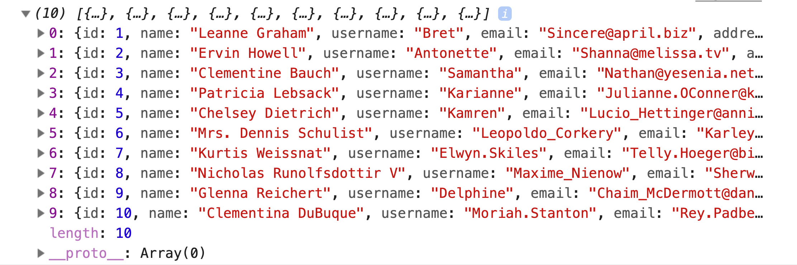
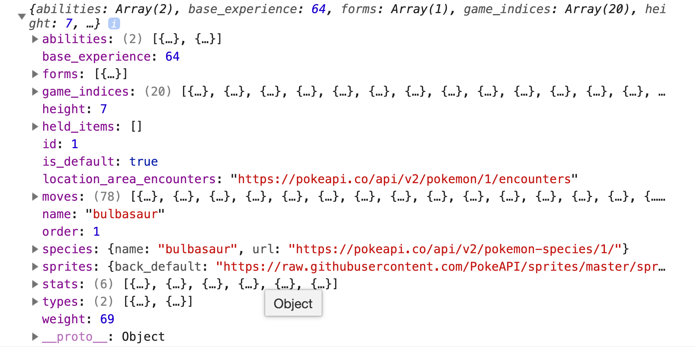

# fetch

Using `fetch` to send HTTP requests from the browser.

## Before You Begin

Be sure to check out a new branch from `main` for this exercise. Detailed instructions can be found [**here**](../../guides/Exercise-Workflow_Starting-an-Exercise).

## Quiz

Answer the following questions in the provided markdown file before turning in this exercise:

- What does `fetch()` return?
- What is the default request method used by `fetch()`?
- How do you specify the request method (`GET`, `POST`, etc.) when calling `fetch`?
- How does `fetch` report errors?

## Exercise Overview

**What is the Fetch API?**
The Fetch API is a modern, versatile interface in JavaScript that replaces the traditional XMLHttpRequest (XHR) for making HTTP requests. It is integrated into the global `window` object, making it available in all modern web browsers. Fetch provides a streamlined and powerful approach for handling network requests with more flexibility and easier syntax compared to XHR.

**Real-World Application of Fetch**

- **API Interactions**: Most modern web applications interact with third-party APIs to fetch data or send data. For example, when retrieving user information from a social media API or posting updates, Fetch provides a cleaner, promise-based approach to handling these asynchronous network requests.
- **Dynamic Content Loading**: Fetch is crucial for dynamically loading content on a webpage without reloading the page. This enhances user experience by displaying new content, like loading new posts in a social feed or updating live sports scores.
- **Form Submission**: Fetch can be used to submit forms asynchronously, allowing for a seamless user experience where form data is processed in the background and responses are handled gracefully without page refreshes.

**Why Use Fetch?**
Fetch is recommended over XHR for several key reasons:

- **Promise-Based**: Fetch operates using promises, allowing for easier management of asynchronous operations.
- **Cleaner Syntax**: Fetch provides a simpler, more readable syntax.
- **Better Error Handling**: Fetch simplifies the process of handling network errors.
- **Flexible**: Fetch offers more control over request headers, request types, and responses.

**Understanding Promises in Fetch**
Fetch initiates a network request that returns a promise, encapsulating the future state of that request:

- **Pending**: Initial state, the operation is ongoing.
- **Fulfilled**: The operation was successful, and the data is available.
- **Rejected**: The operation failed, typically due to a network error.

**What does `fetch()` return?**
Fetch returns a promise that resolves to the `Response` object representing the outcome of the request. This object provides methods to further process the response (e.g., `.json()`, `.text()`, etc.).

**What is the default request method used by `fetch()`?**
The default request method for fetch is `GET`. This means if no method is specified, fetch will perform a `GET` request.

**How do you specify the request method (`GET`, `POST`, etc.) when calling `fetch`?**
To specify the request method for a fetch call, you must pass an options object as the second argument to `fetch()`, setting the `method` property to `'GET'`, `'POST'`, `'PUT'`, `'DELETE'`, etc., like so:

```ts
fetch(url, { method: 'POST' });
```

**How does `fetch` report errors?**
Fetch considers a promise resolved even if the server responds with an error status code (like 404 or 500). It only rejects the promise on network failures or if anything prevented the request from completing. To handle HTTP errors, you need to check the `response.ok` property or the status code directly within the response handling logic.

#### Example: Making a GET Request Using Async/Await with Comprehensive Error Handling

Here’s how you can use the fetch method with async/await for effective error handling:

```ts
// Declare the response data type
interface Data {
  id: number;
  name: string;
}

// Define an asynchronous function to fetch data
async function fetchData() {
  try {
    // Initiate a fetch request and await its response
    const response = await fetch('https://api.example.com/data');

    // Ensure the response status indicates success
    if (!response.ok) {
      // If the status code is not in the successful range, throw an error
      throw new Error(`HTTP error! Status: ${response.status}`);
    }

    // Await the parsing of the response body as JSON
    const data = (await response.json()) as Data;

    // Successfully handle and output the JSON data
    console.log(data);
  } catch (error) {
    // Log any errors that arise during the fetch operation
    console.error('Error:', error);
  }
}

// Execute the async function to perform the fetch operation
fetchData();
```

#### Explanation:

1. **Declare Response Data Type**: Since `fetch` does not know what data type will be returned from the request, it is your responsibility to declare it so that TypeScript can make sure you are using it correctly.

1. **Await Fetch Request**: This section pauses the function's execution until the fetch request completes and a response is returned. This is achieved using the `await` keyword before the `fetch` function call, which waits for the promise returned by `fetch` to either resolve or reject. This allows the function to wait for the HTTP request to complete before moving on to the next line of code.

   ```ts
   const response = await fetch('https://api.example.com/data');
   ```

1. **Response Status Validation**: After receiving the response, this step checks if the HTTP status code indicates success (i.e., a status in the 200-299 range). If `response.ok` is false, which means the status code is not in this range, it throws an error with the status code included in the error message. This ensures that the function only proceeds with a valid response.

   ```ts
   if (!response.ok) {
     throw new Error(`HTTP error! Status: ${response.status}`);
   }
   ```

1. **JSON Parsing**: Once the response is confirmed to be successful, this line parses the response body as JSON. The `response.json()` method also returns a promise, so `await` is used again to ensure that the data is fully parsed into a JavaScript object before any further processing. This step is crucial for handling the JSON data structure commonly used in APIs. Since `Response.json()` is declared to resolve to the type `any`, this line uses TypeScript type assertion to tell TypeScript what type the response actually contains.

   ```ts
   const data = (await response.json()) as Data;
   ```

1. **Error Handling**: The `try...catch` block encapsulates the entire asynchronous operation, allowing for centralized error handling. Any errors thrown during the fetch operation, response validation, or JSON parsing are caught by the `catch` block. Here, the error is logged to the console, providing feedback on what went wrong during the request process.

   ```ts
   } catch (error) {
     console.error('Error:', error);
   }
   ```

#### Conclusion and Best Practices

- Always verify `response.ok` to robustly handle HTTP errors, as fetch does not reject on HTTP error statuses.
- Utilize `async/await` to make asynchronous code readable and maintainable.
- Implement comprehensive error management with `try...catch` to ensure your code handles unexpected failures gracefully, enhancing robustness.
- Always use type assertion to tell TypeScript the response's data type.
  - **Tip**: Check the Dev Tools Network tab to confirm that the type you assert matches the actual response type.

## Exercise

1. Add an HTML skeleton to `index.html` including a script tag for `main.js`.
1. Within `main.ts`, use `fetch` to send a `GET` request to `https://jsonplaceholder.typicode.com/users`, and log the `Array` of user objects to the console.
   - You can use the following data type for the user object:
   ```ts
   interface User {
     id: number;
     name: string;
     username: string;
     email: string;
   }
   ```
1. **Alternatively**, use `fetch` to send a `GET` request to [the PokéAPI](https://pokeapi.co/docs/v2#pokemon) to retrieve your favorite pokémon and log its data to the console. _e.g_ `https://pokeapi.co/api/v2/pokemon/1`
   - You can use the following data type for the pokémon object:
   ```ts
   interface Pokemon {
     name: string;
     height: number;
     weight: number;
   }
   ```
1. Check your error handling. Note that `fetch` will _not_ reject if the server returns a 404 or 500. Instead, it resolves and sets the `ok` property to `false`. So you need to check `res.ok` before extracting the JSON and throw a `new Error` if it's not `ok`. It would be nice to see the server `status` code in the error message.

**Important Note**

If you are using `async and await` for this exercise, note that `await` can only be used within `async` functions or at the top level of _JavaScript modules_. Since we are running this from a script tag in the browser, there is no module, so you must put your code inside an `async` function and then call that function (without `await`).





### Tips!

If VS Code hangs when you open `index.html` with LiveReload Server, try the following:

- Kill LiveReload Server using the "LiveReload" button in the status bar or "Show and Run Commands" (ctrl-shift-P or cmd-shift-P) and searching for "LiveReload Server: Stop Server". This should allow VS Code to run at normal speed.
- Instead of opening `index.html` with LiveReload Server, open the folder containing `index.html` (such as `fetch`) using "Open with LiveReload Server (root)". (Right-click the folder and select that option.)

## Submitting Your Solution

When your solution is complete, submit a Pull Request on GitHub. Detailed instructions can be found [**here**](../../guides/Exercise-Workflow_Submitting-Your-Solution).

## Additional Information

1. Read about [`fetch`](https://developer.mozilla.org/en-US/docs/Web/API/Fetch_API/Using_Fetch) in the MDN Web Docs.
1. Briefly review the [syntax and return value](https://developer.mozilla.org/en-US/docs/Web/API/WindowOrWorkerGlobalScope/fetch#Syntax) of calling `fetch` in the MDN Web Docs.
1. Briefly review the [syntax and return value](https://developer.mozilla.org/en-US/docs/Web/API/Body/json) of the `json()` method found on `fetch` responses.

## Code Reading Example

```typescript
async function fetchData() {
  try {
    // The fetch method is being called with one argument, a string, and we are awaiting the promise
    const response = await fetch('https://api.example.com/data');

    if (!response.ok) {
      throw new Error(`HTTP error! Status: ${response.status}`);
    }

    const data = await response.json();

    console.log(data);
  } catch (error) {
    console.error('Error:', error);
  }
}
```
