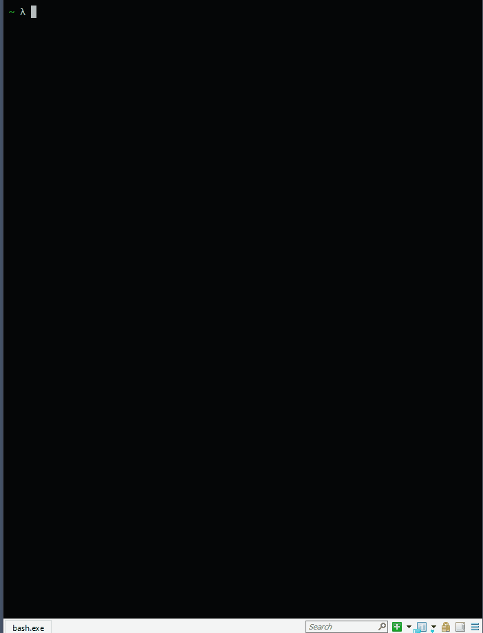
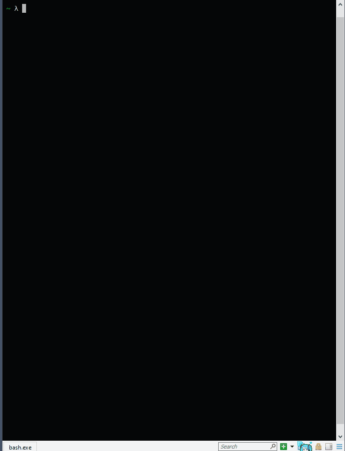
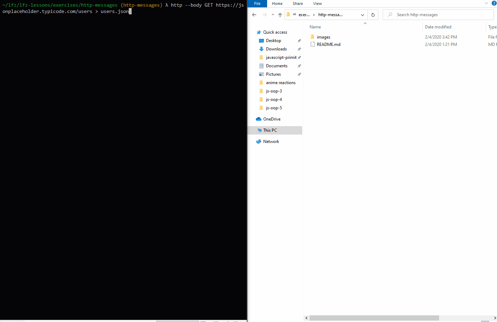
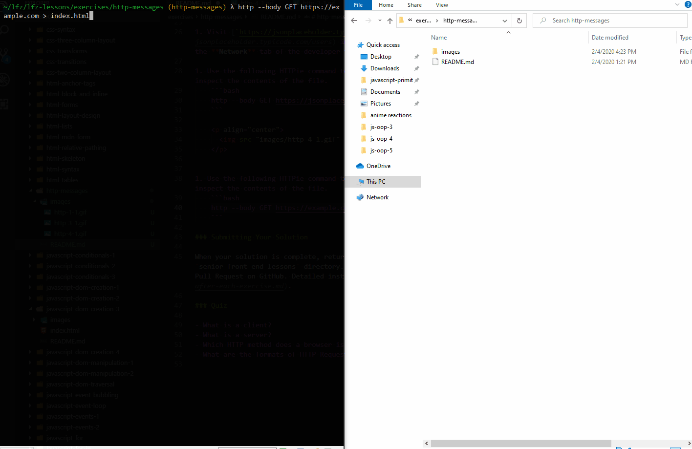

# http-messages

How client and server applications communicate with one another on the Web.

## Before You Begin

Be sure to check out a new branch from `main` for this exercise. Detailed instructions can be found [**here**](../../guides/Exercise-Workflow_Starting-an-Exercise).

## Quiz

Answer the following questions in the provided markdown file before turning in this exercise:

- What is a client?
- What is a server?
- Which HTTP method does a browser issue to a web server when you visit a URL?
- What three things are on the start-line of an HTTP **request** message?
- What three things are on the start-line of an HTTP **response** message?
- What are HTTP headers?
- Where would you go if you wanted to learn more about a specific HTTP Header?
- Is a body required for a valid HTTP request or response message?

## Exercise

1. Read the introduction to the [Client-Server model](https://en.wikipedia.org/wiki/Client%E2%80%93server_model), [Client-server roles](https://en.wikipedia.org/wiki/Client%E2%80%93server_model#Client_and_server_role), and [Client-server communication](https://en.wikipedia.org/wiki/Client%E2%80%93server_model#Client_and_server_communication) on Wikipedia.
1. Read about [HTTP Message formats](https://developer.mozilla.org/en-US/docs/Web/HTTP/Messages) in the MDN Web Docs.
1. In your terminal, change directories into your code solutions directory.
1. [Use HTTPie](https://httpie.io/docs#usage) in your terminal to send a `GET` request to `https://example.com` and compare the output to the **response** format that you've read about.<br>
   **Note:** If `https://example.com` fails (a bug on Windows), try `https://learning-fuze.github.io/example/`.
   **Note:** The `http` command should already be available in your development environment. If not, notify an instructor.<br>

<p align="center">
  
</p>

1. Send the same request again, but with the [`--verbose` output option](https://httpie.io/docs#output-options) to see the **request** you sent followed by the **response** you received.

<p align="center">
  
</p>

1. Visit [`https://jsonplaceholder.typicode.com/users`](https://jsonplaceholder.typicode.com/users) in your web browser and inspect the request in the **Network** tab of the developer tools.

1. Use the following HTTPie command to create a file named `users.json` in the `http-messages` directory. Then inspect the contents of the file.

   ```bash
   http --body GET https://jsonplaceholder.typicode.com/users > http-messages/users.json
   ```

   <p align="center">
     
   </p>

1. Use the following HTTPie command to create a file named `index.html` in the `http-messages` directory. Then inspect the contents of the file.

   ```bash
   http --body GET https://example.com > http-messages/index.html
   ```

   <p align="center">
     
   </p>

## Submitting Your Solution

When your solution is complete, submit a Pull Request on GitHub. Detailed instructions can be found [**here**](../../guides/Exercise-Workflow_Submitting-Your-Solution).
