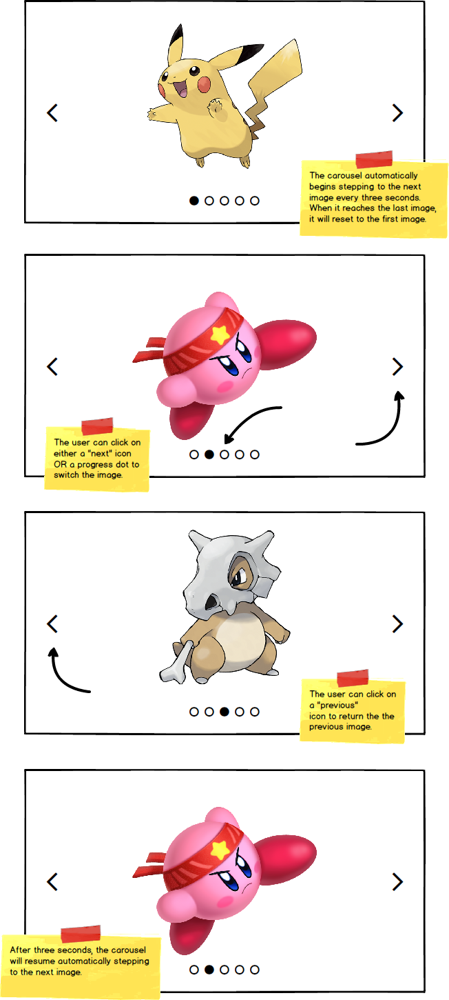

# typescript-carousel

Building an automatic image carousel in HTML, CSS, and TypeScript.

## Before You Begin

Be sure to check out a new branch from `main` for this exercise. Detailed instructions can be found [**here**](../../guides/Exercise-Workflow_Starting-an-Exercise).

### Note

This challenge is not intended to test your ability to Google a tutorial. Apply what you've learned so far to build your solution. Instructors are also happy to answer questions, as always.

## Challenge

For this challenge, you will be using HTML, CSS, and TypeScript to build an image carousel that includes progress indicators, forward and back controls, and automatically cycles through a list of images.

A set of images has been included for you, but you may choose to customize your carousel once you have a working solution. An `index.html`, `styles.css`, and `main.ts` have been included in your starter files. The Font Awesome CSS icon library has also been included for you via a `<link>` tag in the HTML. You can search their [icon gallery here](https://fontawesome.com/icons?d=gallery&m=free). And learn about [how to use them here](https://fontawesome.com/how-to-use/on-the-web/referencing-icons/basic-use)

### Mockup

  

## Submitting Your Solution

When your solution is complete, submit a Pull Request on GitHub. Detailed instructions can be found [**here**](../../guides/Exercise-Workflow_Submitting-Your-Solution).
