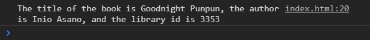
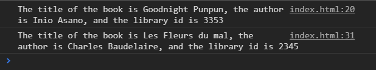
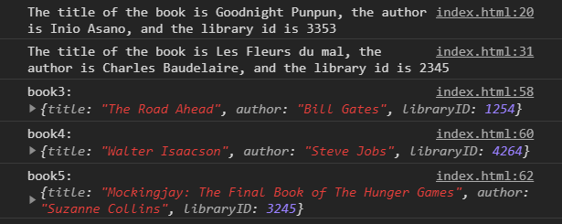
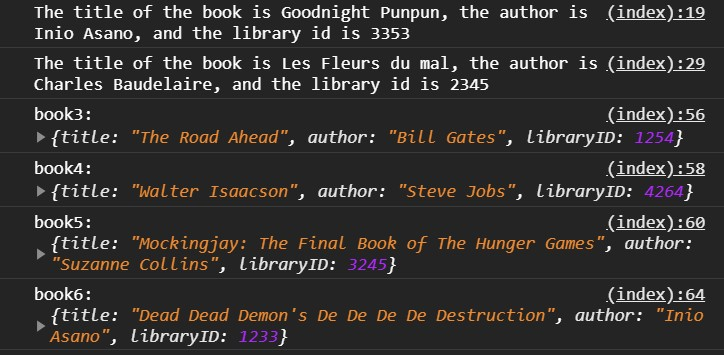

# typescript-destructuring

Defining standalone variables from object properties and array elements.

## Before You Begin

Be sure to check out a new branch from `main` for this exercise. Detailed instructions can be found [**here**](../../guides/Exercise-Workflow_Starting-an-Exercise).

## Quiz Questions

Answer the following questions in the provided markdown file before turning in this exercise:

- What is destructuring, conceptually?
- What is the syntax for `Object` destructuring?
- What is the syntax for `Array` destructuring?
- How can you tell the difference between destructuring and creating `Object`/`Array` literals?

## Exercise Overview

In this exercise, you will practice the concept of destructuring in TypeScript, an essential feature introduced in ES6 that simplifies working with objects and arrays. Destructuring allows for more concise and readable code, enabling you to extract multiple properties from objects or elements from arrays directly into variables.

You will explore various aspects of destructuring:

- **Object Destructuring**: You'll learn to unpack properties from object literals into standalone variables. This will be practiced with objects representing books, where you will also apply aliases and default values.

- **Array Destructuring**: You will destructure arrays to pull out elements directly into variables, which simplifies the process of handling multiple return values from functions or managing data in array formats.

### Object Destructuring

Object destructuring allows you to unpack properties from objects into individual variables. This simplifies accessing multiple properties.

Suppose you have a `person` object with two properties: `firstName` and `lastName`.

```typescript
interface Person {
  firstName: string;
  lastName: string;
}

const person: Person = { firstName: 'John', lastName: 'Doe' };
```

Before ES6, when you want to assign properties of the person object to varialbes, you typically do it like this:

```typescript
const firstName = person.firstName;
const lastName = person.lastName;
console.log(firstName, lastName); // Outputs: John Doe
```

ES6 introduces the object destructuring syntax that provides an alternative way to assign properties of an object to variables:

```typescript
const { firstName, lastName } = person;
console.log(firstName, lastName); // Outputs: John Doe
```

### Aliasing: Destructuring with Renamed Variables

When you want to use different variable names than the object properties, you can rename them during destructuring. This is useful when the original property names do not fit your variable naming convention. The identifier before the colon (`:`) is the property of the object and the identifier after the colon is the variable.

```typescript
// Renaming variables while destructuring
const { firstName: first, lastName: last } = person;
console.log(first, last); // Outputs: John Doe
```

### Destructuring with Default Values

Sometimes an object might not have all the properties you are trying to destructure. In these cases, you can set default values for any properties that are undefined.

```typescript
interface Person {
  firstName: string;
  lastName: string;
  middleName?: string;
}

const personWithMiddle: Person = {
  firstName: 'John',
  middleName: 'C.',
  lastName: 'Doe',
};
const personWithoutMiddle: Person = { firstName: 'John', lastName: 'Doe' };

// Providing default values for properties that might be missing
const { firstName, middleName = 'N/A', lastName } = personWithMiddle;
console.log(firstName, middleName, lastName); // Outputs: John C. Doe
const {
  firstName: first,
  middleName: middle = 'N/A',
  lastName: last,
} = personWithoutMiddle;
console.log(first, middle, last); // Outputs: John N/A Doe
```

### Array Destructuring

Array destructuring is a convenient way to assign elements from an array to variables. This is particularly useful when a function returns an array of values.

```typescript
const numbers: number[] = [70, 80, 90];

// Before array destructuring
const x = numbers[0];
const y = numbers[1];
const z = numbers[2];

// Simple array destructuring
const [x, y, z] = numbers;
console.log(x, y, z); // Outputs: 70, 80, 90
```

### Default Values

When destructuring arrays, you can assign default values to handle cases where the array has fewer elements than expected.

```typescript
const [a, b, c, d = 100] = numbers;
console.log(a, b, c, d); // Outputs: 70, 80, 90, 100
```

## Exercise

1. Create an `index.html` with a basic HTML skeleton.

1. Create a `main.ts` file

1. Change directories into `typescript-destructuring`. Use the TypeScript compiler to watch changes in your TypeScript file and compile it to JavaScript. This will compile your TypeScript into JavaScript and watch for any changes you make in your TypeScript file.

   ```sh
   cd typescript-destructuring
   npx tsc --watch
   ```

1. Add a `<script>` tag at the bottom of your `<body>` tag that points to `main.js`.

1. Create an interface named `Book` with the following properties,

   - title: A `string`
   - author: A `string`
   - libraryId: A `number`

1. Create an object literal with the following three properties, assigned to the variable `book1`:

   ```javascript
   {
     title: 'Goodnight Punpun',
     author: 'Inio Asano',
     libraryId: 3353
   }
   ```

1. Utilizing the `Book` interface that was created, annotate your `book1` variable as `Book`.

1. [Destructure](#object-destructuring) `book1` to create three constants, with the same names as `book1`'s property names, containing the values of `book1`'s properties.

1. Using the three constants above, `log` this sentence to the console:

<p align='center'>
  
</p>

1. Create an object literal with the following three properties, assigned to the variable `book2`:

   ```javascript
   {
     title: "Les Fleurs du mal",
     author: "Charles Baudelaire",
     libraryId: 2345
   }
   ```

1. Utilizing the `Book` interface that was created, annotate your `book2` variable as `Book`.

1. Destructure the properties`book2` into three constants with _different_ names than `book2`'s property names. **Hint:** You will need to use [aliasing](#aliasing-destructuring-with-renamed-variables) to avoid clashing with the constants you declared earlier.

1. Using the three constants above, `log` this sentence to the console:

<p align='center'>
  
</p>

1. Create this array of objects in one statement and assign it to the variable `library`:

   ```javascript
   const library = [
     {
       title: 'The Road Ahead',
       author: 'Bill Gates',
       libraryId: 1254,
     },
     {
       title: 'Walter Isaacson',
       author: 'Steve Jobs',
       libraryId: 4264,
     },
     {
       title: 'Mockingjay: The Final Book of The Hunger Games',
       author: 'Suzanne Collins',
       libraryId: 3245,
     },
     {
       title: "Dead Dead Demon's De De De De Destruction",
       author: 'Inio Asano',
       libraryId: 1233,
     },
   ];
   ```

1. Utilizing the `Book` interface that was created, annotate your `library` variable as an array of `Book`.

1. [Destructure](#array-destructuring) the first three objects from `library` into the three variables `book3`, `book4`, and `book5` (in that order).

1. `log` these three book objects to the console with appropriate console labels.

<p align='center'>
  
</p>

1. In a new statement, destructure the last object from `library` into the variable `book6`. **You can add commas to and array destructuring statement to skip elements**.

   ```js
   const [, second] = array;
   ```

1. Log the last book object to the console with the appropriate console label.

<p align='center'>
  
</p>

## Submitting Your Solution

When your solution is complete, submit a Pull Request on GitHub. Detailed instructions can be found [**here**](../../guides/Exercise-Workflow_Submitting-Your-Solution).

## Additional Reading

1. Read about object destructuring on [javascripttutorial.net](https://www.javascripttutorial.net/es6/javascript-object-destructuring/).
1. Read about array destructuring on [javascripttutorial.net](https://www.javascripttutorial.net/es6/destructuring/).

## Code Reading Example

```typescript
// The properties title, author and libraryID are being destructured from the object book1
const { title, author, libraryID } = book1;

// The title property as title2, the author property as author2, and the libraryID property as LibID2 are being destructured from the object book2
const { title: title2, author: author2, libraryID: libID2 } = book2;

// index 0 as book3, index 1 as book4 and index 2 as book 5 are being destructured from library.
const [book3, book4, book5] = library;

// index 3 as book6 is being destructured from library.
const [, , , book6] = library;
```
