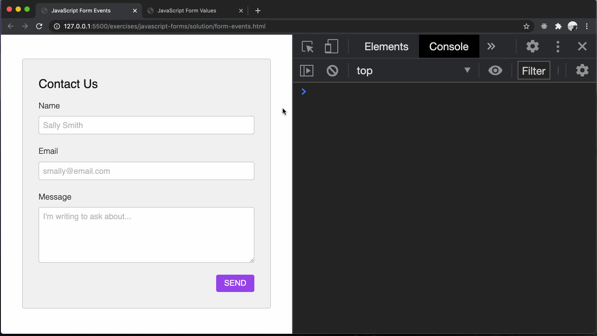
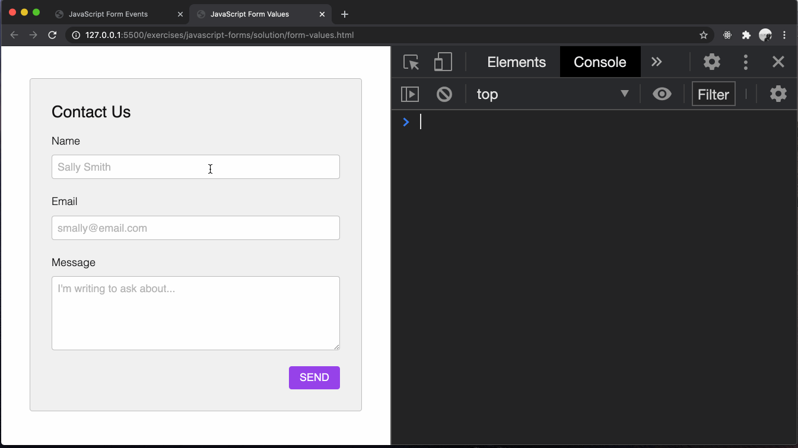

# typescript-forms

Using TypeScript to gather user input from HTML forms.

## Before You Begin

Be sure to check out a new branch from `main` for this exercise. Detailed instructions can be found [**here**](../../guides/starting-an-exercise).

## Quiz

Answer the following questions in the provided markdown file before turning in this exercise

- What event is fired when a user places their cursor in a form control?
- What event is fired when a user's cursor leaves a form control?
- What event is fired as a user changes the value of a form control?
- What event is fired when a user clicks the `"submit"` button within a `<form>`?
- What does the `event.preventDefault()` method do?
- What does submitting a form without `event.preventDefault()` do?
- What property of a form element object contains all of the form's controls.
- What property of a form control object gets and sets its value?
- What is one risk of writing a lot of code without checking to see if it works so far?
- What is an advantage of having your console open when writing a JavaScript program?

## Exercise Overview

In this exercise, you will be learning about how to collect form data in JavaScript. We've already covered how to create forms in HTML, but how can we access and retrieve that data in JavaScript?

Later on in the program, you will see how this ties together full circle when you implement a server and a database, but for now, you will be learning about how to collect user data on the client side.

## Accessing Form Control Elements

Every `<form>` element has an `elements` property that lists all the form controls that are contained within the `<form>` element. You can access a particular form control element either by using the element's `name` or `id` attribute, as well as the index that it appears within the HTMLFormControlsCollection.

For example:

```html
<form id="my-form">
  <label>
    Username:
    <input type="text" id="user-username" name="username" />
  </label>
  <label>
    Full name:
    <input type="text" id="user-full-name" name="full-name" />
  </label>
  <label>
    Password:
    <input type="password" id="user-password" name="password" />
  </label>
</form>
```

```typescript
const formElements = document.querySelector('#my-form').elements;

// Can access form controls by index
const $inputByIndex = formElements[0];

// Can access form controls by id
const $inputById = formElements['user-password'];

// Can access form controls by name
const $inputByName = formElements.username;
```

In the example above, we selected 3 different form control elements, one by their index, another by its `id`, and the last one by its `name`. There is no functionality difference between the three, and you are free to use any of these solutions.

## Union Types

Union types in TypeScript allow you to declare a type that can hold multiple different types of values. This means that a variable with a union type can store values of any of the specified types. Union types are important because they enable developers to create more flexible and expressive code by defining variables that can accept various types of data.

Let's take a look at how we can utilize union types alongside a normal variable.

```typescript
// Union type for a variable
let myVar: string | number;
myVar = 'hello'; // Valid
myVar = 10; // Also valid
// myVar = true; // Error: Type 'boolean' is not assignable to type 'string | number'
```

Here's another example of how we can combine type assertion and union types:

```typescript
const $eventTarget = event.target as HTMLInputElement | HTMLTextAreaElement;
```

We can also utilize union types inside of an `interface`:

```typescript
interface Student {
  name: string;
  age: number;
  address: string | null;
}
```

In the snippets above, union types were specified by separating the types with the pipe (`|`) symbol, and then TypeScript will be able to infer all of the properties and methods that exist on all types in the union.

## Focus Event

The `focus` event in JavaScript is fired when an element has received focus, either from the user selecting it by clicking on it or tabbing over it. The opposite of the `focus` event is the `blur` event which is fired when an element loses focus.

Elements that can receive focus include form elements like `input`, `textarea`, `button`, links (`<a>` elements with an `href`), and any element with the `tabindex` attribute. When an element is focused, it becomes the active element, and is the target of keyboard events.

The `focus` event is often used in form validation, to provide immediate feedback as the user fills out a form. For example, you might use a `focus` event handler to clear any previous validation errors, and a `blur` event handler to validate the field's value.

Here's an example of how you might use the `focus` event:

```typescript
const $input = document.querySelector('input');

if (!$input) throw new Error('$input does not exist');

$input.addEventListener('focus', (event: Event) => {
  const $eventTarget = event.target as HTMLInputElement;
  $eventTarget.style.background = 'lightblue'; // highlight the input field
});
```

In this example, when the user focuses on the input field, its background color changes to light blue. When the input field loses focus, its background color will return to the default.

## Blur Event

The `blur` event in JavaScript is triggered when an element loses focus. This can happen when a user clicks outside the element, or tabs away to another element. The opposite of the `blur` event is the `focus` event, which is fired when a element gains focus.

Elements that can trigger a `blur` include form elements like `input`, `textarea`, `button`, links (`<a>` elements with an `href`), and any element with the `tabindex` attribute. When an element loses focus, it's no longer the active element and will stop receiving keyboard events.

The `blur` event is commonly used in form validation, to check the input values when the user finishes interacting with a field. For example, you might use a `blur` event handler to check if the inputted value is valid and display an error message if it's not.

Here's an example of how you might use the `blur` event:

```typescript
const $input = document.querySelector('input');

if (!$input) throw new Error('$input does not exist');

$input.addEventListener('blur', (event: Event) => {
  const $eventTarget = event.target as HTMLInputElement;
  if (!$eventTarget.value) {
    console.log('Input is required');
  }
});
```

In this example, when the user moves away from the input field, the `blur` event is fired. If the input field is empty, a message is logged to the console.

## Input Event

The `input` event in JavaScript is fired synchronously when the value of an `<input>`, `<select>`, or `<textarea>` element is changed. Unlike the `change` event, which only fires when the value is committed, such as by pressing enter or blurring the field, the `input` event fires immediately after the value is modified. This makes it useful for creating responsive interfaces that react as the user types or modifies a value.

The `input` event can be triggered in various ways, such as by user typing, pasting text, deleting text, or even dragging and dropping text into the input. However, it's important to note that the `input` event is not fired for all input types, such as `checkbox` and `radio`.

Here's an example of how you might use the `input` event:

```typescript
const $input = document.querySelector('input');

if (!$input) throw new Error('$input does not exist');

$input.addEventListener('input', (event: Event) => {
  const $eventTarget = event.target as HTMLInputElement;
  console.log('Input value changed to: ' + $eventTarget.value);
});
```

In this example, every time the user types into the input field, the input event is fired and the new value is logged to the console. This provides real-time feedback as the user types.

## Submit Event

The `submit` event in JavaScript is fired when a form is submitted. This can happen either when the user clicks a submit button or when the user presses Enter while inside a form field.

The `submit` event is particularly useful because it allows you to perform validation or other processing before the form data is actually sent. By default, when a form is submitted, the page is refreshed or navigated to the form's `action` URL. However, you can prevent this default behavior by calling the `preventDefault()` method on the event object, which allows you to handle form submission using JavaScript instead.

Here's an example of how you might use the `submit` event:

```typescript
const $form = document.querySelector('form');

if (!$form) throw new Error('$form does not exist');

$form.addEventListener('submit', (event: Event) => {
  event.preventDefault(); // prevent form from being submitted normally
  console.log('Form submitted');
  // perform validation, send data to server, etc.
});
```

In this example, when the form is submitted, the `submit` event is fired. The default form submission is prevented, and a message is logged to the console.

## Extending Types

In TypeScript, you can extend types using the extends keyword, which is primarily used for interface extension. This allows you to create a new type that includes all the properties and methods of an existing type, and add additional properties or methods. This is useful for creating complex types that share common properties.

```typescript
interface Shape {
  color: string;
}

interface Square extends Shape {
  sideLength: number;
}

let square: Square = { color: 'blue', sideLength: 10 };
```

In this example, `Square` interface extends `Shape` interface, so a `Square` has both a `color` and a `sideLength`.

## Exercise

1. Read through all of the HTML provided in `form-events.html`. Note the **`name`** attribute on each form control element.
1. Read and bookmark the [form controls](https://lms.learningfuze.com/code-guides/Learning-Fuze/curriculum/form-controls) reference guide
1. Change directories into `typescript-forms`. Use the TypeScript compiler to watch changes in your TypeScript file and compile it to JavaScript. This will compile your TypeScript into a JavaScript file and watch for any changes you make in your TypeScript file.

   ```sh
   cd typescript-forms
   npx tsc --watch
   ```

1. In `form-events.ts` (`form-events.html` loads this) define three functions:
   1. `handleFocus(event)`:
      - parameter has a type of `Event`
      - a return type of `void`
      - logs a message that the `'focus'` event was fired
      - assigns `event.target` to a variable `eventTarget`
      - utilizes type assertion to give `eventTarget` a type of `HTMLInputElement` **OR** `HTMLTextAreaElement`
      - logs the `eventTarget.name`
   1. `handleBlur(event)`:
      - parameter has a type of `Event`
      - a return type of `void`
      - logs a message that the `'blur'` event was fired.
      - assigns `event.target` to a variable `eventTarget`
      - utilizes type assertion to give `eventTarget` a type of `HTMLInputElement` **OR** `HTMLTextAreaElement`
      - logs the `eventTarget.name`
   1. `handleInput(event)`:
      - parameter has a type of `Event`
      - a return type of `void`
      - assigns `event.target` to a variable `eventTarget`
      - utilizes type assertion to give `eventTarget` a type of `HTMLInputElement` **OR** `HTMLTextAreaElement`
      - logs the [`eventTarget.name` and `eventTarget.value`](https://developer.mozilla.org/en-US/docs/Web/API/HTMLInputElement)
1. In `form-events.ts` [query the DOM](https://developer.mozilla.org/en-US/docs/Web/API/Document/querySelector) for each form control on the page. That's two `<input>` elements and one `<textarea>` element. Don't forget to `throw` an `Error` if the query fails.
1. [Add three event listeners](https://developer.mozilla.org/en-US/docs/Web/API/EventTarget/addEventListener) to each of the form control elements, one for each of the event types you have written event handler functions for in the steps above:
   - [`'focus'`](#focus-event)
   - [`'blur'`](#blur-event)
   - [`'input'`](#input-event)
1. Hopefully you have had your browser and console open the entire time you were coding to catch errors early. If not, open `form-events.html` in your browser now and play with each of your form controls to watch the events fire and/or fix errors.

<p align="middle">
  
</p>

8. In `form-values.ts` (`form-values.html` loads this), query the DOM for the contact form.
1. Utilizing type assertion, assign a type of `HTMLFormElement` to the variable that stores the DOM reference to the contact form.
1. Listen for the [`'submit'` event](#submit-event) on the form element object.
1. In your event listener callback function, immediately call the [`preventDefault()`](https://developer.mozilla.org/en-US/docs/Web/API/Event/preventDefault) method of the `event` object to prevent the browser from automatically reloading the page with the form's values in the URL.
1. At the top of `form-values.ts`, define an interface named `FormElements` that [`extends`](#extending-types) an [`HTMLFormControlsCollection`](https://developer.mozilla.org/en-US/docs/Web/API/HTMLFormControlsCollection). `FormElements` should have the following properties:
   - `name` - A [`HTMLInputElement`](https://developer.mozilla.org/en-US/docs/Web/API/HTMLInputElement) element
   - `email` - A [`HTMLInputElement`](https://developer.mozilla.org/en-US/docs/Web/API/HTMLInputElement) element
   - `message` - A [`HTMLTextAreaElement`](https://developer.mozilla.org/en-US/docs/Web/API/HTMLTextAreaElement) element
1. In your event listener callback function, get the [`elements`](https://developer.mozilla.org/en-US/docs/Web/API/HTMLFormElement/elements) property of the object that stores the DOM reference to the contact form and assign its return value to a variable `$formElements`.
1. Utilizing type assertion, give the `$formElements` variable a type of `FormElements`
1. Get the **[`value`](https://developer.mozilla.org/en-US/docs/Web/API/HTMLInputElement) of each** of your form controls by name via the `$formElements` variable : _e.g._ `$formElements.name.value` and store them all in one object.
1. Log the object to the console.
1. [Reset the form](https://developer.mozilla.org/en-US/docs/Web/API/HTMLFormElement/reset).
1. When you submit your form, the page **should not** reload.

<p align="middle">
  
</p>

## Submitting Your Solution

When your solution is complete, submit a Pull Request on GitHub. Detailed instructions can be found [**here**](../../guides/submitting-your-solution).

## Additional Resources

1. Read about the [`HTMLFormElement` interface](https://developer.mozilla.org/en-US/docs/Web/API/HTMLFormElement) which represents a `<form>` element in the DOM.

1. Read about how to access form elements via the [`elements` property](https://developer.mozilla.org/en-US/docs/Web/API/HTMLFormElement/elements).

1. Read about how you can combine types utilizing [union types](https://www.typescriptlang.org/docs/handbook/2/everyday-types.html#union-types)

   - [`'focus'`](https://developer.mozilla.org/en-US/docs/Web/API/Element/focus_event)
   - [`'blur'`](https://developer.mozilla.org/en-US/docs/Web/API/Element/blur_event)
   - [`'input'`](https://developer.mozilla.org/en-US/docs/Web/API/HTMLElement/input_event)

1. Listen for the [`'submit'` event](https://developer.mozilla.org/en-US/docs/Web/API/HTMLFormElement/submit_event) on the form element object.

1. Read about [extending types](https://www.typescriptlang.org/docs/handbook/2/objects.html#extending-types).

## Code Reading Example

```typescript
// A new interface FormElements is being declared which extends the HTMLFormControlsCollection interface
interface FormElements extends HTMLFormControlsCollection {
  name: HTMLInputElement;
  email: HTMLInputElement;
  message: HTMLTextAreaElement;
}

// The target property of the event object is being asserted as a HTMLInputElement or a HTMLTextAreaElement and assigned to the variable $eventTarget
const $eventTarget = event.target as HTMLInputElement | HTMLTextAreaElement;
```
