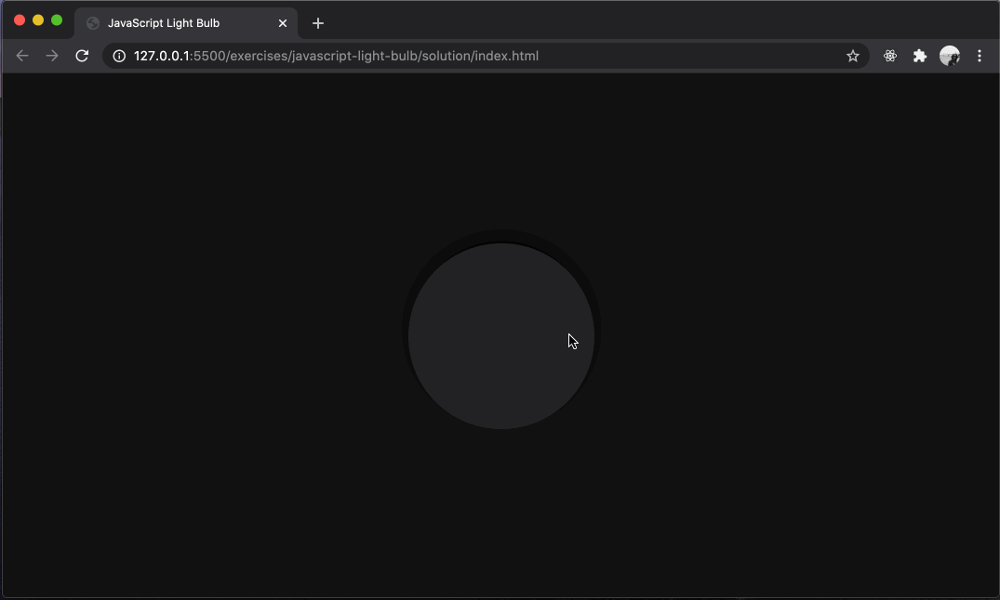

# typescript-light-bulb

Building a simple light bulb simulation using HTML, CSS, and TypeScript.

## Before You Begin

Be sure to check out a new branch from `main` for this exercise. Detailed instructions can be found [**here**](../../guides/starting-an-exercise).

## Challenge

For this challenge you will be writing HTML, CSS, and TypeScript to build a simple simulation of a light bulb. Your solution does not have to look fancy at first, but it should look visually appealing. Carefully consider color choices.

### Strategy

A simple approach to this problem is to first concentrate on your HTML and CSS before adding any functionality. Then listen for clicks on the light bulb to either turn it on or off.

### Example

  

### Resources

#### HTML

- [`div` element](https://developer.mozilla.org/en-US/docs/Web/HTML/Element/div)

#### CSS

- [`display: flex`](https://developer.mozilla.org/en-US/docs/Web/CSS/CSS_Flexible_Box_Layout)
- [`align-items`](https://developer.mozilla.org/en-US/docs/Web/CSS/align-items)
- [`justify-content`](https://developer.mozilla.org/en-US/docs/Web/CSS/justify-content)
- [`border-radius`](https://developer.mozilla.org/en-US/docs/Web/CSS/border-radius)
- [`background-color`](https://developer.mozilla.org/en-US/docs/Web/CSS/background-color)
- [`box-shadow`](https://developer.mozilla.org/en-US/docs/Web/CSS/box-shadow)
- [`margin`](https://developer.mozilla.org/en-US/docs/Web/CSS/margin)
- [`width`](https://developer.mozilla.org/en-US/docs/Web/CSS/width)
- [`height`](https://developer.mozilla.org/en-US/docs/Web/CSS/height)

#### JavaScript

- [`document.querySelector()`](https://developer.mozilla.org/en-US/docs/Web/API/Document/querySelector)
- [`addEventListener()`](https://developer.mozilla.org/en-US/docs/Web/API/EventTarget/addEventListener)
- [`element.className`](https://developer.mozilla.org/en-US/docs/Web/API/Element/className)
- [`click` event](https://developer.mozilla.org/en-US/docs/Web/API/Element/click_event)

## Submitting Your Solution

When your solution is complete, submit a Pull Request on GitHub. Detailed instructions can be found [**here**](../../guides/submitting-your-solution).
