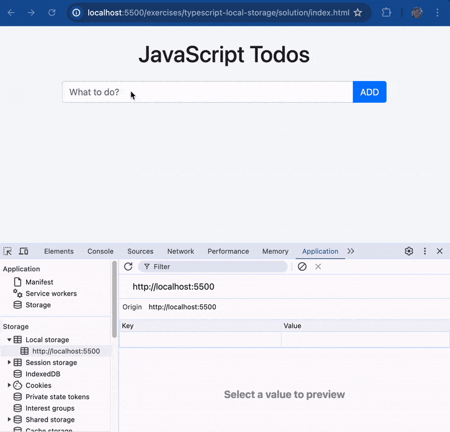
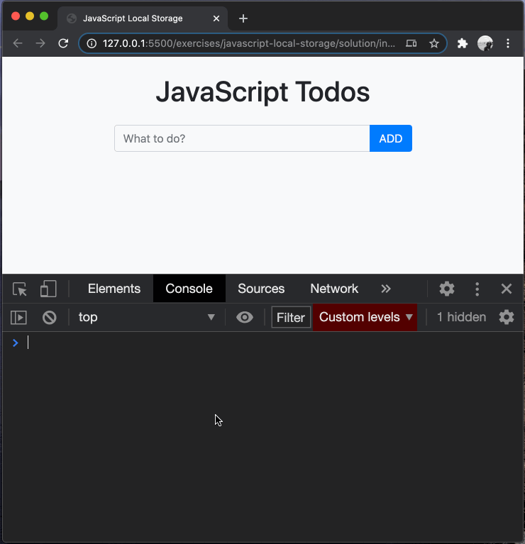
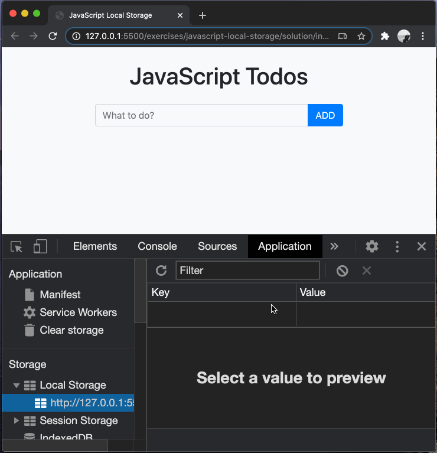

# typescript-local-storage

Persisting data to `localStorage` in the browser.

## Before You Begin

Be sure to check out a new branch from `main` for this exercise. Detailed instructions can be found [**here**](../../guides/starting-an-exercise).

## Quiz

Answer the following questions in the provided markdown file before turning in this exercise:

- How do you store data in `localStorage`?
- How do you retrieve data from `localStorage`?
- What data type can `localStorage` save in the browser?
- When is the safest time to store user data?

## Overview

In this exercise, you will be learning how we can take advantage of HTML5's `localStorage` to store our data, and utilize TypeScript to have it persist between renders.

Note the example functionality below:

<p align="middle">
  
</p>

Let's look at a breakdown of what is happening in the example above:

- When the user makes changes, the data containing all of the task list items is stored to `localStorage`
- After the page is refreshed, all task list items still appear on the page, and the state of their completed status also persists.
- The data containing all of the task list items is now visible in the "Application" tab of the dev tools.

## Problem Breakdown

Now it's time to think like a programmer and break this problem down into completable steps.

As an example of how to break a problem down into completable steps, let's break down the series of steps that need to be completed in order to get the example functionality:

1. Create a write function to handle the following actions:
   - Stringify the `todos` array to a JSON string
   - Store a key/value pair to `localStorage` containing the JSON string
1. Create a read function to handle the following actions:
   - Read the key/value pair from `localStorage` to get the JSON string
   - Parse the JSON string into the `todos` array
1. Call the write function every time the user changes the tasks
1. Call the read function to replace the `todos` array with the data stored in `localStorage`, if there is any.

Notice that there is now a clear set of steps that must be completed for the example functionality to work. Solving a problem is much easier when you know the steps to complete.

Being able to break down bigger problems into smaller ones is something that should be practiced regularly, as it is a primary skill for any developer.

## What is `localStorage`?

`localStorage` is a web storage object that allows JavaScript sites and apps to store data persistently in a user's browser. It's part of the Web Storage API, along with `sessionStorage`, which has similar functionality but different persistence behavior.

The data stored in `localStorage` is saved across browser sessions. This means that even if you close your browser or restart your computer, the data in `localStorage` will still be available the next time you open the browser. This makes `localStorage` a good choice for saving non-sensitive data that needs to persist over time, such as user preferences or the state of a user interface.

`localStorage` should not be used for storing sensitive information, such as passwords or credit card numbers, because it's not designed to be a secure storage mechanism. Also, `localStorage` is synchronous and can block the main thread, so it's not recommended for large amounts of data.

### Working with `localStorage`

`localStorage` provides a simple key-value store, similar to a JavaScript object. It has methods for setting, getting, and removing data:

1. `setItem(key, value)`: This method allows you to store data in `localStorage`. It takes two parameters: a `key` and a `value`. Both parameters should be strings. If the key already exists, this method will update the value.

   ```typescript
   localStorage.setItem('name', 'Billy');
   ```

1. `getItem('key')`: This method allows you to retrieve data from `localStorage`. It takes one parameter: the `key` of the data you want to retrieve. It returns the value as a string, or `null` if the key does not exist.

   ```typescript
   const name = localStorage.getItem('name');
   console.log('name', name); // Outputs: 'Billy'
   ```

1. `removeItem('key')`: This method allows you to remove data from `localStorage`. It takes one parameter: the `key` of the data you want to remove.

   ```typescript
   localStorage.removeItem('name');
   ```

1. `localStorage.clear()`: This method allows you to remove all data from `localStorage` for the current origin. It takes no parameters.

   ```typescript
   localStorage.clear();
   ```

It's important to note that `localStorage` can only store strings. If you want to store objects or arrays, you'll need to serialize them with `JSON.stringify` before storing, and then deserialize them with `JSON.parse` when retrieving.

## Storing data in `localStorage`

In general, whenever the user modifies data, the new value should be stored as quickly as possible. This ensures that the data is safely persisted and won't be lost if the application crashes, the user shuts off their computer, etc. Ideally, the application would not update its interface until the data is safely stored so that the user has confidence their data will not be lost.

For example, the following shows a typical scenario for storing user data:

```typescript
const todos: Todo[] = [
  {
    task: 'Finish Homework',
    completed: true,
  },
];

function writeTodos(): void {
  const todosJSON = JSON.stringify(todos);
  localStorage.setItem('todos-storage', todosJSON);
}

function addTodo(todo: Todo): void {
  todos.push(todo);
  writeTodos();
}
```

Let's break down the snippet above:

1. An array of `Todo` objects is created and stored in the variable `todos`.
1. A write function is created that stores the `Todo` array to `localStorage`.
   1. The `todos` array gets stringified so that it can be added to `localStorage`. It's important to note that only strings can be saved to `localStorage`, so the `todos` array must be JSON stringified.
   1. A key/value pair gets added to `localStorage`, which stores the JSON string representing the `todos` array.
1. When the user adds a new `Todo` task:
   1. The new `Todo` gets added to the `todos` array.
   1. The write function gets called to immediately store the updated `todos` to `localStorage`.

## Exercise

In this exercise you are given a small TypeScript application that can record todo items entered by the user. However, reloading the browser causes all of the data to be lost. You will be enhancing the application to store the data in `localStorage` and recover the data when the page reloads.

1. Change directories into `typescript-local-storage`. Use the TypeScript compiler to watch changes in your TypeScript file and compile it to JavaScript. This will compile your TypeScript into JavaScript and watch for any changes you make in your TypeScript file.

   ```sh
   cd typescript-local-storage
   npx tsc --watch
   ```

1. Read all of the HTML in the provided `index.html`.
1. Read all of the CSS in the provided `styles.css`.
1. Open `index.html` in your browser. You should be able to add and check off some todos, but if you refresh the page, they're all lost.
1. Open your console and then find the **Application > Local Storage** section of the developer tools to see if any items are listed.

<p align="middle">
  
</p>

The primary purpose of `localStorage` is to provide a way to save data across browser sessions. Once data is saved to `localStorage`, it can be accessed any time later, even after the browser is closed and reopened. This makes `localStorage` ideal for saving user preferences, settings, and state between page visits without needing to re-fetch or recreate data every time a page is loaded.

<p align="middle">
  
</p>

6. Open the provided `data.ts` file in your code editor.
1. Create a function named `writeTodos` to:
   1. [stringify()](https://developer.mozilla.org/en-US/docs/Web/JavaScript/Reference/Global_Objects/JSON/stringify) the provided `todos` variable into a JSON string and assign the return value to a new variable named `todosJSON`
   1. [store the value of `todosJSON`](#working-with-localstorage) with a key of `'todos-storage'`
1. In `main.ts` call the `writeTodos` function whenever the user changes the Todo tasks:

   - when the user adds a task (in the `submit` event handler)
   - when the user modifies a task (in the `change` event handler)

1. Try adding some todos to the application and changing their "completed" status. You will find that although the changes are saved to `localStorage`, if you refresh the page they are lost. We will now fix this:

1. In `data.ts` create a function named `readTodos` to:

   1. [read the `todos` JSON](#working-with-localstorage) using the key `'todos-storage'`
   1. If there is a JSON string in `localStorage`, [parse()](https://developer.mozilla.org/en-US/docs/Web/JavaScript/Reference/Global_Objects/JSON/parse) it and return the resulting `todos` array; otherwise return an empty array
   1. Instead of assigning an empty array to `todos`, call `readTodos` and assign its result to `todos`

1. Refresh the page, you should see no errors in the console.
1. The app should now use the data from `localStorage` if it exists. Test it out by creating and modifying some items and reloading the browser.

### Final Result

<p align="middle">
  
</p>

## Submitting Your Solution

When your solution is complete, submit a Pull Request on GitHub. Detailed instructions can be found [**here**](../../guides/submitting-your-solution).

## Additional Resources

1. Read about [`localStorage`](https://developer.mozilla.org/en-US/docs/Web/API/Window/localStorage) and its [`setItem`](https://developer.mozilla.org/en-US/docs/Web/API/Storage/setItem) and [`getItem`](https://developer.mozilla.org/en-US/docs/Web/API/Storage/getItem) methods in the MDN Web Docs. You can try the examples in the documentation from your browser console and then check **Application > Local Storage** again to see your saved item(s).
