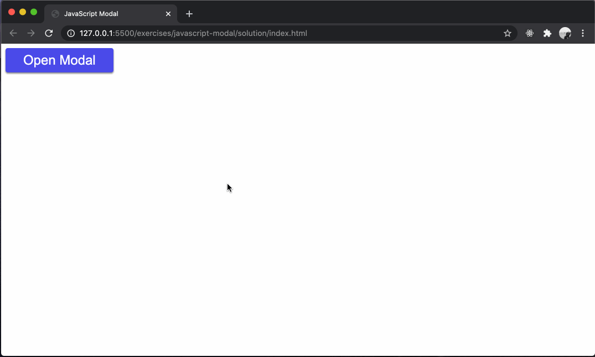

# typescript-modal

Building a modal dialog using HTML, CSS, and TypeScript.

## Before You Begin

Be sure to check out a new branch from `main` for this exercise. Detailed instructions can be found [**here**](../../guides/starting-an-exercise).

## Quiz

Answer the following questions in the provided markdown file before turning in this exercise:

- What is the `<dialog>` element used for?
- How do you display a modal dialog?
- How do you hide a modal dialog?
- What is the difference between the `showModal` & `show` methods?

## The `dialog` element

The `<dialog>` element in HTML is a native web component used to create pop-up dialogs or modal windows on a webpage. It provides a simple way to create a dialog box or a modal without the need for JavaScript libraries or frameworks. The `<dialog>` element is important because it provides a standardized, accessible way to create dialogs, which are a very common feature in web applications.

The `<dialog>` element provides a few methods to control its visibility and interaction with the user:

1. **`show()`**: This method displays the dialog box. The dialog is displayed where it is in the normal flow of the document, and does not have a modal backdrop to block interaction with the rest of the page.

   ```typescript
   const $dialog = document.querySelector('dialog');
   $dialog.show();
   ```

1. **`showModal()`**: This method displays the dialog box as a modal. A modal dialog box is one that blocks interaction with the rest of the page. It is displayed on top of the page with a backdrop, and it's centered on the screen.

   ```typescript
   const $dialog = document.querySelector('dialog');
   $dialog.showModal();
   ```

1. **`close()`**: This method closes the dialog box.

   ```typescript
   const $dialog = document.querySelector('dialog');
   $dialog.close();
   ```

## Exercise

1. Read code provided in `index.html` & `styles.css`.

1. Change directories into `typescript-modal`. Use the TypeScript compiler to watch changes in your TypeScript file and compile it to JavaScript. This will compile your TypeScript into a JavaScript file and watch for any changes you make in your TypeScript file.

   ```sh
   cd typescript-modal
   npx tsc --watch
   ```

1. In `main.ts`, query the DOM for the `.open-modal`, `.dismiss-modal`, & `dialog` elements and assign the return values to variables.

   1. Don't forget to `throw` an `Error` if any of your queries fail.

1. Add a `"click"` event listener to the variable that was created to query for `.open-modal`.

1. Inside of the callback function for the `.open-modal` event listener, call the [`showModal()`](#the-dialog-element) method on the variable which contains the DOM reference for the `<dialog>` element.

1. Add a `"click"` event listener to the variable that was created to query for `.dismiss-modal`.

1. Inside of the callback function for the `.dismiss-modal` event listener, call the [`close()`](#the-dialog-element) method on the variable which contains the DOM reference for the `<dialog>` element.

<p align="middle">
  
</p>

## Submitting Your Solution

When your solution is complete, submit a Pull Request on GitHub. Detailed instructions can be found [**here**](../../guides/submitting-your-solution).

## Additional Reading

1. Read about the [`<dialog>` element](https://developer.mozilla.org/en-US/docs/Web/HTML/Element/dialog).

1. Read about the [`showModal()` method](https://developer.mozilla.org/en-US/docs/Web/API/HTMLDialogElement/showModal).

1. Read about the [`show()` method](https://developer.mozilla.org/en-US/docs/Web/API/HTMLDialogElement/show).

1. Read about the [`close()` method](https://developer.mozilla.org/en-US/docs/Web/API/HTMLDialogElement/close).

## Code Reading Example

```typescript
// The showModal method of the $dialog object is being called with 0 arguments
$dialog.showModal();
```
