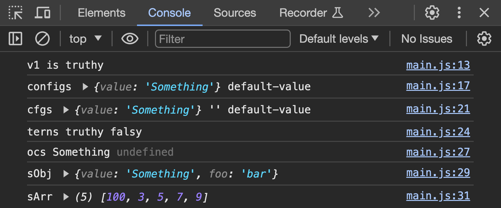

# typescript-operators

Useful new ES6 operators.

## Before You Begin

Be sure to check out a new branch from `main` for this exercise. Detailed instructions can be found [**here**](../../guides/Exercise-Workflow_Starting-an-Exercise).

## Quiz

Answer the following questions in the provided markdown file before turning in this exercise:

- What are the `&&` (logical AND) and `||` (logical OR) operators and how can they be used outside of `if` statements?
- What is "short-circuit evaluation" and how does it apply to `&&` and `||`?
- What is the `??` (nullish coalescing) operator and how does it differ from `||`?
- What is the `?:` (ternary) operator? How does it differ from `if/else`?
- What is the `?.` (optional chaining) operator? When would you use it?
- What is `...` (spread) syntax? How do you use it with arrays and objects?
- What data types can be spread into an array? Into an object?
- How does spread syntax differ from rest syntax?

## Exercise Overview

In this exercise, you will apply TypeScript's ES6 operators in practical coding scenarios within a TypeScript project environment. The focus will be on understanding and utilizing the operators in various contexts to manipulate data and control flow in your scripts. You will write code that demonstrates the operators' functionalities in real-world use cases.

1. **Logical AND (`&&`)**: You will write expressions that utilize the logical AND operator to check for truthy values in variables and take action based on those checks.

   - **Example Tasks**:
     - Log a custom message if certain variables are truthy.
     - Combine conditions to manage complex checks concisely.

2. **Logical OR (`||`)**: This task involves using the logical OR operator to set default values or take alternate actions when variables hold falsy values.

   - **Example Tasks**:
     - Assign default values to variables.
     - Use OR for fallback operations in assignments.

3. **Nullish coalescing operator (`??`)**: You will use this operator to handle cases where variables might be null or undefined, providing a reliable way to set default values without the pitfalls of logical OR with falsy values like 0 or ''.

   - **Example Tasks**:
     - Securely assigning defaults to potentially null or undefined variables.
     - Contrast with logical OR to demonstrate differences.

4. **Conditional (ternary) operator (`?:`)**: The ternary operator will be applied for concise conditional expressions, allowing you to write less verbose conditional assignments and operations.

   - **Example Tasks**:
     - Simplify small if/else blocks into single-line ternary operations.
     - Use in return statements or variable assignments for clarity and brevity.

5. **Optional chaining (`?.`)**: You will apply this operator to safely access properties on objects that might not exist, preventing runtime errors due to undefined or null object properties.

   - **Example Tasks**:
     - Safely access deeply nested properties.
     - Prevent errors in accessing properties of potentially null/undefined objects.

6. **Spread syntax (`...`)**: This will be used to clone or merge objects and arrays, which is extremely useful in state management scenarios, like managing local component state in frameworks like React.
   - **Example Tasks**:
     - Combine multiple objects or arrays into a single object or array.
     - Use spread to pass an array of arguments to a function.

### Logical AND (`&&`)

- **Syntax**: `expr1 && expr2`
- **Description**: Evaluates `expr2` only if `expr1` is truthy.
- **Example**:
  ```typescript
  const a = true;
  const b = 'Logged in';
  console.log(a && b); // Output: 'Logged in'
  ```

### Logical OR (`||`)

- **Syntax**: `expr1 || expr2`
- **Description**: Evaluates `expr2` only if `expr1` is falsy.
- **Example**:
  ```typescript
  const a = false;
  const b = 'Guest';
  console.log(a || b); // Output: 'Guest'
  ```

### Nullish coalescing operator (`??`)

- **Syntax**: `expr1 ?? expr2`
- **Description**: Returns `expr2` if `expr1` is `null` or `undefined`, otherwise returns `expr1`.
- **Example**:
  ```typescript
  const a = null;
  const b = 'Default';
  console.log(a ?? b); // Output: 'Default'
  ```

### Conditional (ternary) operator (`?:`)

- **Syntax**: `condition ? expr1 : expr2`
- **Description**: Evaluates `expr1` if the condition is true, otherwise evaluates `expr2`.
- **Example**:
  ```typescript
  const a = 10,
    b = 5;
  console.log(a > b ? 'a is greater' : 'b is greater'); // Output: 'a is greater'
  ```

### Optional chaining (`?.`)

- **Syntax**: `obj?.prop`
- **Description**: Returns `undefined` if `obj` is `null` or `undefined`, otherwise returns `obj.prop`.
- **Example**:
  ```typescript
  const user = { name: 'Alice', address: { zipcode: 12345 } };
  console.log(user?.address?.zipcode); // Output: 12345
  console.log(user?.profile?.age); // Output: undefined
  ```

### Spread syntax (`...`)

- **Syntax**: `[...iterableObj, newElement]` for arrays or `{...obj, newProp: value}` for objects.
- **Description**: Allows an iterable such as an array or a string to be expanded in places where zero or more arguments or elements are expected, or an object expression to be expanded in places where zero or more key-value pairs are expected.
- **Example**:
  - Arrays:
    ```typescript
    const arr = [1, 2, 3];
    const newArr = [...arr, 4];
    console.log(newArr); // Output: [1, 2, 3, 4]
    ```
  - Objects:
    ```typescript
    const obj = { id: 1, name: 'Alice' };
    const newObj = { ...obj, age: 25 };
    console.log(newObj); // Output: { id: 1, name: 'Alice', age: 25 }
    ```

## Exercise

1. Change directories into `typescript-operators`. Use the TypeScript compiler to watch changes in your TypeScript file and compile it to JavaScript. This will compile your TypeScript into JavaScript and watch for any changes you make in your TypeScript file.

   ```sh
   cd typescript-operators
   npx tsc --watch
   ```

1. Open `index.html` in the browser.
1. Read the code provided inside of `main.ts`
1. Inside of `main.ts`, write **two** expressions that utilize the [Logical AND (&&) Operator](#logical-and-) to do the following:
   1. Logs `"v1 is truthy"` to the console if `v1` is truthy.
   1. Logs `"v2 is truthy"` to the console if `v2` is truthy.
1. Write **two** expressions that utilize the [Logical OR (`||`) Operator](#logical-or-) to do the following:
   1. Assigns `'default-value'` to a variable `config1` only if `v1` is falsy
   1. Assigns `'default-value'` to a variable `config2` only if `v2` is falsy
1. Log both the `config1` & `config2` variables to the console.
1. Write **three** expressions that utilize the [Nullish coalescing operator (`??`)](#nullish-coalescing-operator-) to do the following:
   1. Assigns `'default-value'` to a variable `cfg1` only if `v1` is `undefined`
   1. Assigns `'default-value'` to a variable `cfg2` only if `v2` is `undefined`
   1. Assigns `'default-value'` to a variable `cfg3` only if `v3` is `undefined`
1. Log the `cfg1`, `cfg2`, & `cfg3` variables to the console.
1. Write **two** expressions that utilize the [Conditional (ternary) operator (`?:`)](#conditional-ternary-operator-) to do the following:
   1. Assigns `'truthy'` to a variable `tern1` only if `v1` is truthy, otherwise, assigns `'falsy'`
   1. Assigns `'truthy'` to a variable `tern2` only if `v2` is truthy, otherwise, assigns `'falsy'`
1. Log both the `tern1` & `tern2` variables to the console.
1. Write **two** expressions that utilizes the [Optional chaining operator (`?.`)](#optional-chaining-) to do the following:
   1. Assigns the `value` property of the `v1` object to the variable `oc1`
   1. Assigns the `city` property of the `address` property of the `details` property of the `v5` object, to the variable `oc2`.
1. Log the `oc1` & `oc2` variables to the console
1. Write **one** expression that utilizes the [Spread syntax (`...`)](#spread-syntax-) to do the following:
   1. Copies the `v1` object and adds a property `foo` with the value of `'bar'`, and assigns it to the variable `sObj`.
1. Log the `sObj` variable to the console
1. Write **one** expression that utilizes the [Spread syntax (`...`)](#spread-syntax-) to do the following:
   1. Copies the `v4` array and adds the element 100 to the front of the array, and assigns it to the variable `sArr`.
1. Log the `sArr` variable to the console

### NOTES:

- Each expression should be it's own line of code. You should not try and complete multiple expressions in the same statement.
- If you are stuck, try reviewing the **Short-circuit evaluation** sections of the specific operator's MDN page.

<p align="middle">
  
</p>

## Submitting Your Solution

When your solution is complete, submit a Pull Request on GitHub. Detailed instructions can be found [**here**](../../guides/Exercise-Workflow_Submitting-Your-Solution).

## Additional Reading

1. In the [MDN Operators](https://developer.mozilla.org/en-US/docs/Web/JavaScript/Reference/Operators) documentation, read about the following operators. These ones are ones that are commonly used, though you may want to glance through some of the others.
   - [Logical AND (&&)](https://developer.mozilla.org/en-US/docs/Web/JavaScript/Reference/Operators/Logical_AND)
   - [Logical OR (||)](https://developer.mozilla.org/en-US/docs/Web/JavaScript/Reference/Operators/Logical_OR)
   - [Nullish coalescing operator (??)](https://developer.mozilla.org/en-US/docs/Web/JavaScript/Reference/Operators/Nullish_coalescing)
   - [Conditional (ternary) operator (?:)](https://developer.mozilla.org/en-US/docs/Web/JavaScript/Reference/Operators/Conditional_Operator)
   - [Optional chaining (?.)](https://developer.mozilla.org/en-US/docs/Web/JavaScript/Reference/Operators/Optional_chaining)
   - [Spread syntax (...)](https://developer.mozilla.org/en-US/docs/Web/JavaScript/Reference/Operators/Spread_syntax)

## Code Reading Example

```typescript
// The log method of the console object is being called with one argument, a && (logical and operator) b
console.log(a && b);
```
