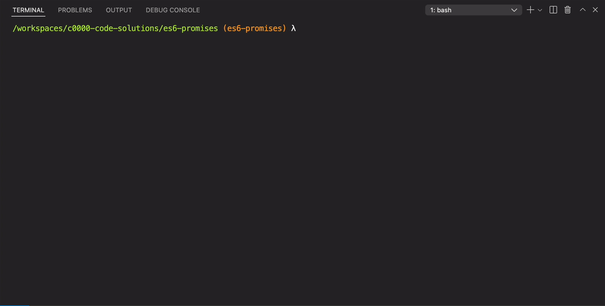

# typescript-promises

Working with objects that represent future results.

## Before You Begin

Be sure to check out a new branch from `main` for this exercise. Detailed instructions can be found [**here**](../../guides/Exercise-Workflow_Starting-an-Exercise).

## Quiz

Answer the following questions in the provided markdown file before turning in this exercise:

- What is the Event Queue model of Promises?
- What are the three states a Promise can be in?
- How do you handle the fulfillment of a Promise?
- How do you handle the rejection of a Promise?

## Exercise Overview

In JavaScript, Promises are powerful constructs that make working with asynchronous operations more manageable and readable. They provide a way to schedule actions to be performed once the asynchronous task has been completed, either successfully (fulfilled) or with an error (rejected). Please note, you will rarely find yourself in a situation where you have to create a Promise. However, you will frequently need to handle Promises. This typically occurs when dealing with APIs or libraries that perform asynchronous operations such as network requests, file operations, or any tasks that depend on timing or external data flow, where you do not have immediate access to the result.

For instance, when interacting with third-party APIs—whether it's fetching data from a server, querying a database, or performing complex computations asynchronously—these APIs often use Promises to handle the asynchronous nature of HTTP requests. By using Promises, these operations do not block the main execution thread, allowing your application to remain responsive while waiting for data to load or an operation to complete.

A Promise has three states:

1. **Pending:** The initial state; the promise is neither resolved nor rejected.
2. **Fulfilled:** The promise has been resolved, and the corresponding then handlers will be called.
3. **Rejected:** The promise has been rejected, and the catch handlers will be invoked.

## Event Queue Model of Promises

Promises in JavaScript follow an Event Queue Model where callback functions associated with asynchronous operations are placed into a queue when the operation completes. The JavaScript runtime environment has an event loop that continuously checks this queue and processes the callbacks in the order they arrive. This ensures that the code execution is non-blocking and that operations that take a longer time don't stall the execution of other scripts.

## Creating a Simple Promise in TypeScript

We'll start with a basic example to understand how to create and work with Promises using TypeScript.

### Example Code

```typescript
function waitFor(seconds: number): Promise<string> {
  return new Promise<string>((resolve, reject) => {
    if (seconds <= 0) {
      reject(new Error('Seconds must be greater than 0'));
      return;
    }

    setTimeout(() => {
      resolve(`Waited for ${seconds} seconds`);
    }, seconds * 1000);
  });
}

waitFor(3)
  .then((message) => console.log(message))
  .catch((error) => console.error(`Error: ${error.message}`));
```

### Code Breakdown

1. **`function waitFor(seconds: number): Promise<string> { ... }`:** This function takes a number `seconds` and returns a Promise that resolves to a string after waiting for the specified number of seconds.

2. **`return new Promise<string>((resolve, reject) => { ... });`:** We return a new Promise of type `string`, providing `resolve` and `reject` functions to control its outcome.

3. **`if (seconds <= 0) { ... }`:** We check if the provided seconds are less than or equal to zero. If so, we immediately reject the promise with an error message.

4. **`setTimeout(() => { ... }, seconds * 1000);`:** We use the `setTimeout` function to delay the resolution of the promise by `seconds` multiplied by 1000 (to convert seconds to milliseconds), then resolve the promise with a message.

5. **`waitFor(3) ...`:** We invoke the `waitFor` function with an argument of 3, intending to wait for 3 seconds.

6. **`.then((message) => console.log(message))`:** Once the promise is fulfilled (after 3 seconds), we log the resolved message to the console.

7. **`.catch((error) => console.error(`Error: ${error.message}`));`:** If the promise is rejected (for example, if `seconds` were 0 or less), we catch the error and log it to the console. This will output the error message without any additional error object metadata that might be included if you were to log the entire error object.

## Handling Fulfillment and Rejection of Promises

- **Fulfillment Handling:** The fulfillment of a Promise is managed by attaching a `.then()` method to the Promise. The `.then()` method takes a callback function that will be called when the Promise is resolved.

- **Rejection Handling:** The rejection of a Promise is managed by attaching a `.catch()` method. The `.catch()` method is used to define a callback that will be executed if the Promise is rejected.

## Exercise

**For this exercise's commands to work properly, your terminal needs to be within the exercise's directory.** In your terminal, change directories with the `cd` command. This will change which directory your future commands are executed in.

```bash
cd name-of-exercise
```

**⚠️ Your terminal prompt should look like this with the name of the exercise at the end of the path as well as the branch name in `()` parenthesis. ⚠️**

#### Yes ✅

```shell
/workspaces/c000-code-solutions/name-of-exercise (name-of-exercise) λ
```

#### No ❌

```shell
/workspaces/c000-code-solutions (name-of-exercise) λ
```

> **Note:** To run the code in this exercise, you will use the terminal to execute the TypeScript files, using the TypeScript execution program, [tsx (**T**ype**S**cript E**x**ecute)](https://github.com/privatenumber/tsx). You can check if you have `tsx` installed by executing the command `tsx --version`. If you do not have it installed, you can install it with `npm install -g tsx`.

1. Examine the function definition in `take-a-chance.ts`. `takeAChance` takes a `name` and returns a `Promise` object that will randomly **fulfill** or **reject** after a two second delay.
1. Within `main.ts`:
   - call `takeAChance` and pass it your name.
   - add the following [handlers](#handling-fulfillment-and-rejection-of-promises) to the `Promise` object returned by `takeAChance`:
     - one that logs the winning success message if the promise becomes fulfilled
     - one that logs the [`error.message`](https://developer.mozilla.org/en-US/docs/Web/JavaScript/Reference/Global_Objects/Error/message) to the console if the promise becomes rejected
     - Note: The proper way to add handlers to a `Promise` is to chain them:
       ```js
       promise
         .then(....)
         .catch(....);
       ```
1. Test your code with `tsx`.
   ```bash
   tsx main.ts
   ```



#### Advanced

It is often useful to develop a conceptual model of how things work, even if that model doesn't quite match reality. This conceptual model can help us think about the code and understand how it works, without the need for a detailed, precise understanding of how things work.

For Promises, a good conceptual model is the Event Queue / Event Loop model. The JavaScript runtime system maintains an Event Queue of tasks that need to be executed. When the runtime has finished all its synchronous work, it looks at the Event Queue to see if there are any tasks to run. If so, it runs them. When those tasks run, they will typically do the following:

- Call a callback function indicating that the task has completed,
- Or if it has not completed, put another (similar) task back onto the Event Queue.

When a Promise is created it is passed a callback function that is the Promise task (such as making a network call). The code then typically registers `then` handlers, `catch` handlers, and `finally` handlers (by calling `Promise.then`, `Promise.catch`, and/or `Promise.finally` on the promise). When the promise task completes, the appropriate handlers are called.

With this in mind, the Event Queue model of Promises is as follows:

- When the Promise is created, the Promise task is synchronously put onto the Event Queue.
- Synchronous execution of the calling code continues until the end of the function(s).
- When the current functions complete, the Event Loop runs.
- The Promise task is taken from the Event Queue and executed.
- After the Promise task completes:
  - If it completes successfully, the Promise calls the `then` handler
  - If it completes with an error, the Promise calls the `catch` handler
  - The Promise then calls the `finally` handler (in all cases).

The first twenty minutes of Phil Roberts's JSConf [presentation on the JavaScript Event Loop](https://www.youtube.com/watch?v=8aGhZQkoFbQ) provides a good, visual presentation of the Event Queue / Event Loop model. Watch this after completing and submitting the exercise.

### Finish

**For `git` to work properly, your terminal needs to be within the root of your local repository.** You have been executing commands in your exercise directory, but it's time to return "up" one level. In your terminal, change directories with the `cd` command as shown in the example below. This will change which directory your future commands are executed in.

**`..` means "parent directory".**

```bash
cd ..
```

#### Yes ✅

```shell
/workspaces/c000-code-solutions (name-of-exercise) λ
```

#### No ❌

```shell
/workspaces/c000-code-solutions/name-of-exercise (name-of-exercise) λ
```

## Submitting Your Solution

When your solution is complete, submit a Pull Request on GitHub. Detailed instructions can be found [**here**](../../guides/Exercise-Workflow_Submitting-Your-Solution).

## Additional Reading

1. Read [Introducing asynchronous JavaScript](https://developer.mozilla.org/en-US/docs/Learn/JavaScript/Asynchronous/Introducing) in the MDN Web Docs.
1. Read the introductory paragraph and description of [Promises](https://developer.mozilla.org/en-US/docs/Web/JavaScript/Reference/Global_Objects/Promise) in the MDN Web Docs. Stop before reading **Incumbent settings object tracking**.
1. Read about [`Promise.then`](https://developer.mozilla.org/en-US/docs/Web/JavaScript/Reference/Global_Objects/Promise/then) in the MDN Web Docs.
1. Read about [`Promise.catch`](https://developer.mozilla.org/en-US/docs/Web/JavaScript/Reference/Global_Objects/Promise/catch) in the MDN Web Docs.

## Code Reading Example

```typescript
// The waitFor method is being called with one argument, 0
waitFor(0)
  // the then method is being called with one argument, a callback function with one property, message, then the log method of the console object is being called with one argument, message.
  .then((message) => console.log(message))
  // the catch method is being called with one argument, a callback function with a parameter error. The error method of the console object is being called with one argument, a template literal interpolating the message property of the error object.
  .catch((error) => console.error(`Error: ${error.message}`));
```
