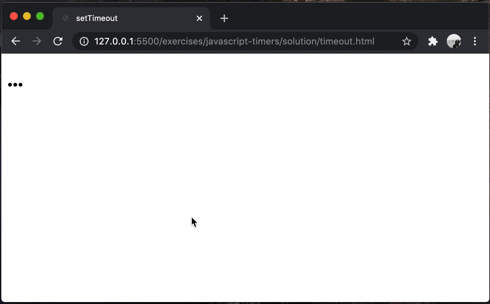
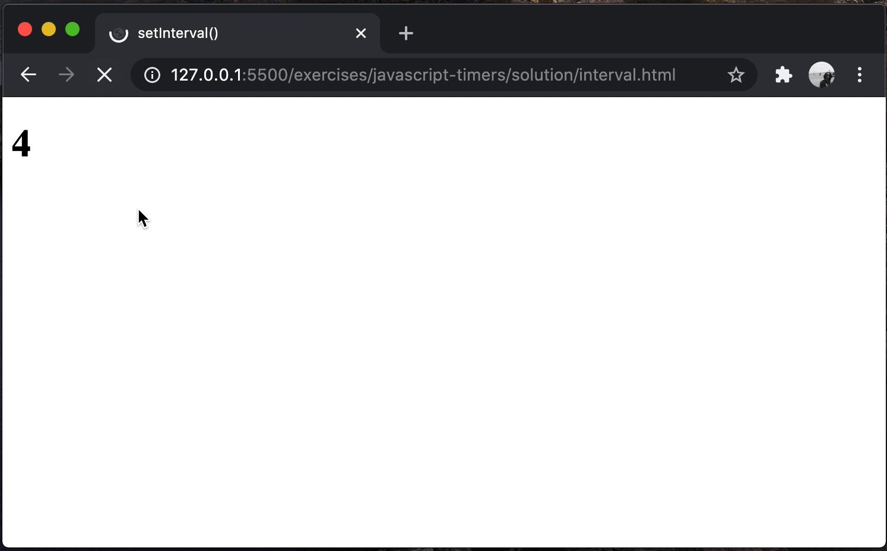

# typescript-timers

Executing TypeScript callback functions... later.

## Before You Begin

Be sure to check out a new branch from `main` for this exercise. Detailed instructions can be found [**here**](../../guides/Exercise-Workflow_Starting-an-Exercise).

## Quiz

Answer the following questions in the provided markdown file before turning in this exercise:

- What is a "callback" function?
- Besides adding an event listener callback function to an element or the `document`, what is one way to delay the execution of a JavaScript function until some point in the future?
- How can you set up a function to be called repeatedly without using a loop?
- What is the default time delay if you omit the `delay` parameter from `setTimeout()` or `setInterval()`?
- What do `setTimeout()` and `setInterval()` return?

## Exercise Overview

In this exercise, you will apply your understanding of JavaScript timing functions, specifically `setTimeout` and `setInterval`, within a TypeScript environment. You will create small projects that utilize these methods to manipulate DOM elements dynamically after set time intervals. This will include a countdown and delayed text changes on a webpage. Understanding these asynchronous operations in the context of TypeScript will give you a practical foundation in managing time-based coding challenges.

## Review: Callback Functions in JavaScript

A callback function is a function that is passed as an argument to another function and is executed after its parent function has completed. Callbacks are often used in JavaScript to handle asynchronous operations, such as waiting for a file to load or a timer to complete.

### Example of a Callback Function

Here's a basic example of a callback function used to simulate a simple asynchronous operation using `setTimeout`:

```javascript
function greet(name, callback) {
  console.log('Hi ' + name);
  callback();
}

function callMe() {
  console.log('I am callback function');
}

greet('John', callMe);
```

In this example, the `callMe` function is passed as a callback to the `greet` function. It gets called right after the greeting is printed to the console.

## The setTimeout Method

The `setTimeout` function is used to execute a function after a specified number of milliseconds. It is useful for adding a delay before executing a function.

### Syntax of setTimeout

```javascript
setTimeout(function, delay, [arg1, arg2, ...]);
```

- `function`: The function to execute.
- `delay`: The time in milliseconds to wait before executing the function (1000 milliseconds = 1 second).
- `[arg1, arg2, ...]`: Additional arguments which are passed through to the function specified by `function`.

### Example of setTimeout

```javascript
console.log('Hello');
setTimeout(function () {
  console.log('World!');
}, 2000); // Delays the second log by 2000 milliseconds (2 seconds)
```

This example will first log 'Hello' to the console, then, after a 2-second delay, 'World!' will appear.

### Default Delay

If the `delay` parameter is omitted, `setTimeout()` uses a default delay of 0 milliseconds.

## The setInterval Method

The `setInterval` function is used to repeatedly execute a function at fixed intervals defined in milliseconds.

### Syntax of setInterval

```javascript
setInterval(function, delay, [arg1, arg2, ...]);
```

- `function`: The function to execute repeatedly.
- `delay`: The interval in milliseconds between each function call (1000 milliseconds = 1 second).
- `[arg1, arg2, ...]`: Additional arguments which are passed through to the function each time it is called.

### Example of setInterval

```javascript
let count = 0;
const intervalId = setInterval(function () {
  count++;
  console.log('Count:', count);
  if (count >= 5) {
    clearInterval(intervalId); // Stops the interval after counting to 5
  }
}, 1000); // Executes the function every 1000 milliseconds (1 second)
```

This code sets up an interval that counts to 5 at one-second intervals. Once it reaches 5, it uses `clearInterval` to stop the interval.

### Default Delay

If the `delay` parameter is omitted, `setInterval()` uses a default delay of 0 milliseconds, causing the function to execute as frequently as possible.

## Exercise

1. Change directories into `typescript-timers`. Use the TypeScript compiler to watch changes in your TypeScript file and compile it to JavaScript. This will compile your TypeScript into a JavaScript file and watch for any changes you make in your TypeScript file.

   ```sh
   cd typescript-timers
   npx tsc --watch
   ```

1. Read the code in `timeout.html` and then open it in your browser.
1. Write code in `timeout.ts` to update the page heading from `'...'` to `'Hello There'` after two seconds have passed. Here is an example. **It shouldn't actually repeat, that's just the GIF repeating. 🌀**

<p align="middle">
  
</p>

1. Read the code in `interval.html` and then open it in your browser.
1. Write code in `interval.ts` to update the page heading in a countdown from `4` to `'~Earth Beeeelooowww Us~'`. Make sure that the page stops updating after the text shows. Here is an example. **It shouldn't actually repeat, that's just the GIF repeating. 🌀**
<p align="middle">
  
</p>

## Submitting Your Solution

When your solution is complete, submit a Pull Request on GitHub. Detailed instructions can be found [**here**](../../guides/Exercise-Workflow_Submitting-Your-Solution).

## Additional Information

1. Review the definition of a [callback function](https://developer.mozilla.org/en-US/docs/Glossary/Callback_function) in the MDN Web Docs.
1. Read about [`setTimeout()` in the MDN Web Docs](https://developer.mozilla.org/en-US/docs/Web/API/WindowOrWorkerGlobalScope/setTimeout). **Note:** `setTimeout()` is a global function, so you can call it directly by name without any object to the left of the dot. _e.g._ `setTimeout(func, delay)`.
1. Read about [`setInterval()`](https://developer.mozilla.org/en-US/docs/Web/API/WindowOrWorkerGlobalScope/setInterval) and [`clearInterval()`](https://developer.mozilla.org/en-US/docs/Web/API/WindowOrWorkerGlobalScope/clearInterval) in the MDN Web Docs. **Note:** These are both global functions, so can call them directly by name without any object to the left of the dot. _e.g._ `setInterval(func, delay)` and `clearInterval(timerId)`.

## Code Reading Example

```typescript
// The querySelector method of the document object is being called with one argument, the CSS selector class message, and the return value of that call is being assigned to the variable $heading
const $heading = document.querySelector('.message');

// A function named helloWorld is being defined with no parameters, with a return type of void
function helloWorld(): void {
  // The string Hello World is being assigned to the textContent property of the $heading object
  $heading.textContent = 'Hello World';
}

// The setTimout function is being called with two arguments: helloWorld, and 1000
setTimeout(helloWorld, 1000);
```
