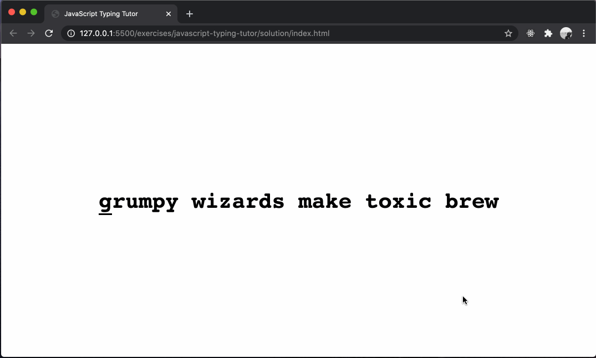

# typescript-typing-tutor

Building a simple typing tutor application using HTML, CSS, and TypeScript.

## Before You Begin

Be sure to check out a new branch from `main` for this exercise. Detailed instructions can be found [**here**](../../guides/starting-an-exercise).

## Challenge

For this challenge you will be writing HTML, CSS, and TypeScript to build a simple typing tutor application. Your solution does not have to look fancy at first, but it should look visually appealing. Consider color choice and font styling.

### Strategy

A simple approach to this problem is to put your phrase into the HTML file. Each character of the phrase should be in its own `` element. Query the DOM for all `` elements. As the user triggers `'keydown'` events on the `document`, keep track of what character of the phrase they are on by its index.

- The user should know what key to type next.
- The user should know when they got a key right.
- The user should know when they got a key wrong and need to retry.

### Example

  

### Optional Enhancements

- When the user finishes typing the phrase, they can see their typing accuracy.
- When the user finishes typing the phrase, they can be asked if they'd like to play again.

### Resources

#### HTML

- [`div` element](https://developer.mozilla.org/en-US/docs/Web/HTML/Element/div)
- [`h1` element](https://developer.mozilla.org/en-US/docs/Web/HTML/Element/Heading_Elements)
- [`span` element](https://developer.mozilla.org/en-US/docs/Web/HTML/Element/span)

#### CSS

- [`white-space: pre`](https://developer.mozilla.org/en-US/docs/Web/CSS/white-space)
- [`font-size`](https://developer.mozilla.org/en-US/docs/Web/CSS/font-size)
- [`font-family`](https://developer.mozilla.org/en-US/docs/Web/CSS/font-family)
- [`display: flex`](https://developer.mozilla.org/en-US/docs/Web/CSS/CSS_Flexible_Box_Layout)
- [`align-items`](https://developer.mozilla.org/en-US/docs/Web/CSS/align-items)
- [`justify-content`](https://developer.mozilla.org/en-US/docs/Web/CSS/justify-content)
- [`border-bottom`](https://developer.mozilla.org/en-US/docs/Web/CSS/border-bottom)
- [`color`](https://developer.mozilla.org/en-US/docs/Web/CSS/color)
- [`margin`](https://developer.mozilla.org/en-US/docs/Web/CSS/margin)

#### JavaScript

- [`document.querySelectorAll()`](https://developer.mozilla.org/en-US/docs/Web/API/Document/querySelectorAll)
- [`NodeList`](https://developer.mozilla.org/en-US/docs/Web/API/NodeList)
- [`addEventListener()`](https://developer.mozilla.org/en-US/docs/Web/API/EventTarget/addEventListener)
- [`element.textContent`](https://developer.mozilla.org/en-US/docs/Web/API/Node/textContent)
- [`element.className`](https://developer.mozilla.org/en-US/docs/Web/API/Element/className)
- [`keydown` event](https://developer.mozilla.org/en-US/docs/Web/API/Document/keydown_event)
- [`event.key`](https://developer.mozilla.org/en-US/docs/Web/API/KeyboardEvent/key)

## TypeScript

- [`KeyboardEvent`](https://microsoft.github.io/PowerBI-JavaScript/interfaces/_node_modules_typedoc_node_modules_typescript_lib_lib_dom_d_.keyboardevent.html)

## Submitting Your Solution

When your solution is complete, submit a Pull Request on GitHub. Detailed instructions can be found [**here**](../../guides/submitting-your-solution).
