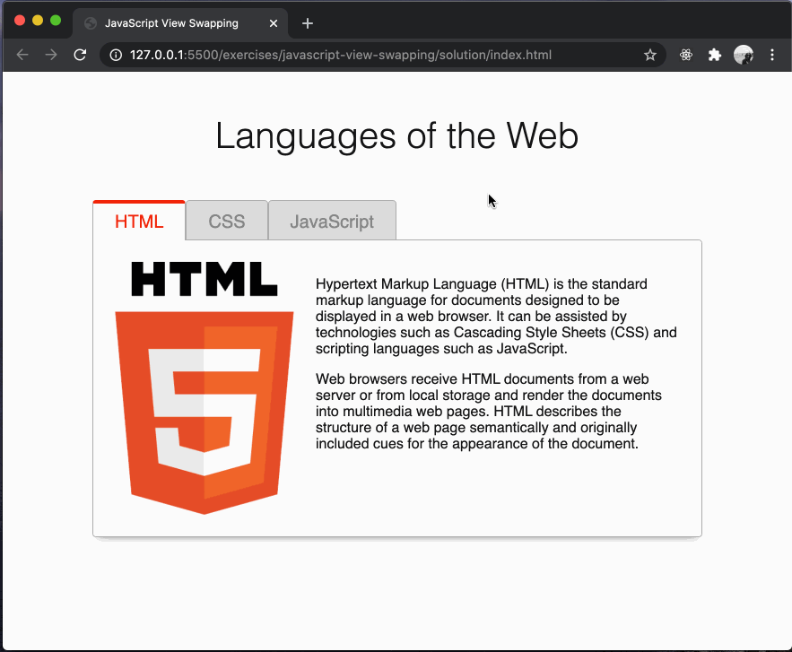
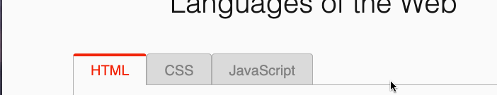

# typescript-view-swapping

Using events and DOM manipulation to show or hide page content.

## Before You Begin

Be sure to check out a new branch from `main` for this exercise. Detailed instructions can be found [**here**](../../guides/starting-an-exercise).

## Quiz

Answer the following questions in the provided markdown file before turning in this exercise:

- What is the `event.target`?
- What is the effect of setting an element to `display: none`?
- What does the `element.matches()` method take as an argument and what does it return?
- How can you retrieve the value of an element's attribute?
- At what steps of the solution would it be helpful to log things to the console?
- If you were to add another tab and view to your HTML, but you didn't use event delegation, how would your TypeScript code be written instead?
- If you didn't use a loop to conditionally show or hide the views in the page, how would your TypeScript code be written instead?

## Overview

In this exercise, you will be learning how you can dynamically show & hide content on the webpage utilizing TypeScript.

Note the example functionality below:

<p align="middle">
  
</p>

Let's look at a breakdown of what is happening in the example above:

- When a user clicks on a tab, the following actions occur:
  - The tab that we are currently on loses focus. Its text color changes and the colored border at the top disappears.
  - The content inside of the tab gets hidden.
  - The tab that was clicked on gains focus. Its text color changes and the colored border at the top appears.
  - The content inside of the tab that was clicked is shown.

## Problem Breakdown

Now it's time to think like a programmer and break this problem down into completable steps.

As an example of how to break a problem down into completable steps, let's breakdown the series of steps that need to be completed in order to get the example functionality:

1. The elements that will be referenced and given event listeners must be selected from the DOM and stored in variables.
1. An event listener must be attached to the `TabContainer` element.
1. A callback function must be created to handle the click events which occur on the `TabContainer`.
1. The callback function must perform the following actions:
   - Store the `event.target` to a variable
   - Verify that a `.tab` element was clicked before proceeding with any further functionality
   - Loop over all of the `.tab` elements and perform the following actions:
     - Compare the current `.tab` element to the `.tab` that was interacted with by the user
     - Update the current `.tab` element's class name to either add or remove focus
   - Retrieve the current view from the `dataset` and store the result to a variable
   - Loop over all of the `.view` elements and perform the following actions:
     - Retrieve the current `.view` element's `data-view` attribute and compare it to the current view
     - Update the current `.view` element's class name to either show or hide its content

Notice that there is now a clear set of steps that must be completed for the example functionality to work. Solving a problem is much easier when you know the steps to complete.

Being able to break down bigger problems into smaller ones is something that should be practiced regularly, as it is a primary skill for any developer.

## The `matches` method

The `matches` method in JavaScript is a powerful tool used to check if an element would be selected by a given CSS selector string. It's part of the Element interface in the Document Object Model (DOM) and is useful for dynamically testing whether elements match a certain selector without having to loop through a collection of elements.

The `matches` method returns a boolean value - `true` if the element would be selected by the specified selector string, and `false` if it wouldn't.

Here's an example of how to use the `matches` method:

```typescript
const $div = document.querySelector('div');

if ($div.matches('.myClass')) {
  console.log('The <div> has class "myClass"');
} else {
  console.log('The <div> does not have class "myClass"');
}
```

In this example, the `matches` method is used to check if the selected `div` element has a class of `myClass`.

The `matches` method is a convenient way to test elements against a selector and can simplify your code when you need to conditionally perform actions based on an element's attributes or its relation to other elements in the DOM.

## The `dataset` property

The `dataset` property in JavaScript provides read/write access to all the custom data attributes (`data-*`) set on an element. It is part of the HTMLElement interface in the Document Object Model (DOM). This property allows you to store extra information directly within the HTML, without having to use other hacky solutions.

The `dataset` property is an object, and each custom data attribute is represented as a property within this object. The name of the property is the camel-cased version of the data attribute without the `data-` prefix. For example, a `data-user-id` attribute corresponds to `dataset.userId`.

Here's an example of how to use the `dataset` property:

```html
<div id="user" data-user-id="12345" data-user-name="JohnDoe">User Info</div>
```

```typescript
const $user = document.getElementById('user');

console.log($user.dataset.userId); // Outputs: "12345"
console.log($user.dataset.userName); // Outputs: "JohnDoe"
```

In this example, the `dataset` property is used to access the custom data attributes `data-user-id` and `data-user-name` of the `div` element.

The `dataset` property provides a simple and standardized way to embed custom data in your HTML elements, which can then be easily accessed and manipulated with JavaScript.

## The `getAttribute` method

The `getAttribute` method in JavaScript is a part of the Element interface in the Document Object Model (DOM). It allows you to retrieve the value of a specified attribute on the element. If the given attribute does not exist, the value returned will either be `null` or `""` (an empty string).

The `getAttribute` method takes one argument: the name of the attribute you want to retrieve the value of.

Here's an example of how to use the `getAttribute` method:

```typescript
const $div = document.querySelector('div');
const classValue = $div.getAttribute('class');
```

In this example, `getAttribute` is used to retrieve the value of the `class` attribute from the first `div` element in the document.

The `getAttribute` method is a useful tool when you need to dynamically read the values of attributes in your HTML elements.

## Exercise

1. Review [How JavaScript Event Delegation Works](https://davidwalsh.name/event-delegate).
1. Open the provided `index.html` in your browser and then read the code in both `index.html` and `styles.css`.
1. Change directories into `typescript-view-swapping`. Use the TypeScript compiler to watch changes in your TypeScript file and compile it to JavaScript. This will compile your TypeScript into a JavaScript file and watch for any changes you make in your TypeScript file.

   ```sh
   cd typescript-view-swapping
   npx tsc --watch
   ```

1. Next, we'll focus on connecting our script to the webpage, setting the foundation for our interactive view swapping functionality. Start by querying the DOM in `main.ts` to obtain references to:
   - the `'.tab-container'`
   - a [`NodeList`](https://developer.mozilla.org/en-US/docs/Web/API/NodeList) of all `'.tab'` elements
   - a [`NodeList`](https://developer.mozilla.org/en-US/docs/Web/API/NodeList) of all `'.view'` elements
1. Enable the interactive aspect of your webpage by attaching a `'click'` event listener to the `'.tab-container'` that:
   1. Assigns `event.target` to a variable `$eventTarget` that utilizes type assertion to give it a type of `HTMLDivElement`.
   1. Checks to see if the `$eventTarget` [`matches('.tab')`](#the-matches-method) to ensure that the user has to actually click on a `'.tab'` to change the page. If it does match, then...
   1. Loop through the [`NodeList`](https://developer.mozilla.org/en-US/docs/Web/API/NodeList) of `'.tab'` elements and compare each of them to the `$eventTarget`. The element that equals the `$eventTarget` should have its `className` updated to make it `.active`. All others should not be made `'.active'`.
   <p align="middle">
     
   </p>
1. Read about the [`dataset`](#the-dataset-property) property of the HTMLElement interface in the MDN Web Docs.
   - **Note**: The `dataset` property is only used alongside `data-*` custom attributes. For all other attributes that do not begin with `data-*`, you need to use something like `getAttribute()`.
1. Implement the core functionality of switching views in the application. Only the content view corresponding to the selected tab should be visible, while all other views are hidden, effectively achieving the tab-based navigation functionality of the app. Add code to your event listener callback function to do the following **only if a `'.tab'` was clicked**:
   1. [Get the value](#the-getattribute-method) of the `'data-view'` attribute of the `$eventTarget` and put it in a variable.
   1. Loop through the [`NodeList`](https://developer.mozilla.org/en-US/docs/Web/API/NodeList) of `.view` elements and compare each of their `'data-view'` attribute values to the variable declared in the previous step. All `'.view'` elements should be `'.hidden'` except the one that has a `'data-view'` attribute that equals the variable declared in the previous step.
      - **Note**: If you try to use `dataset` inside this loop, you will run into a type error. In order to work around this, you can either use the `getAttribute` method or use type assertion.

## Submitting Your Solution

When your solution is complete, submit a Pull Request on GitHub. Detailed instructions can be found [**here**](../../guides/submitting-your-solution).

## Additional Resources

1. Read about the [`matches`](https://developer.mozilla.org/en-US/docs/Web/API/Element/matches) method on MDN.

1. Read about the [`dataset`](https://developer.mozilla.org/en-US/docs/Web/API/HTMLElement/dataset) property on MDN.

1. Read about the [`getAttribute()`](https://developer.mozilla.org/en-US/docs/Web/API/Element/getAttribute) method of DOM element objects in the MDN Web Docs.
